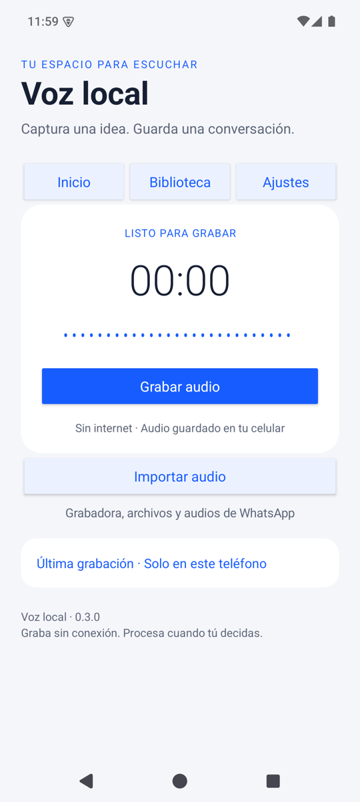
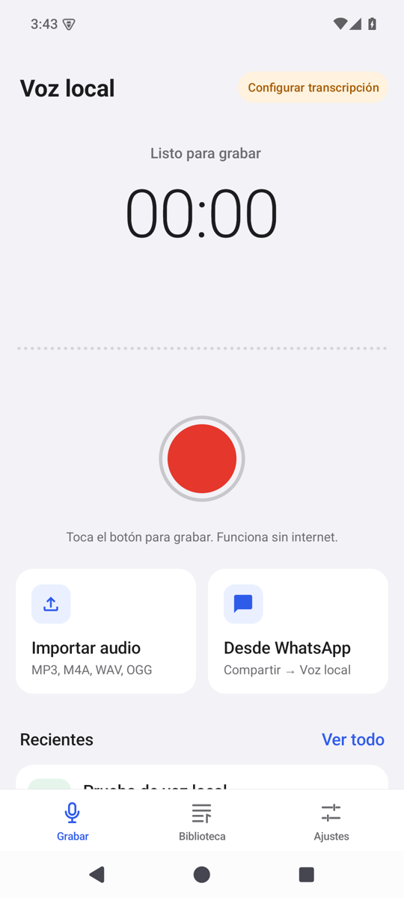
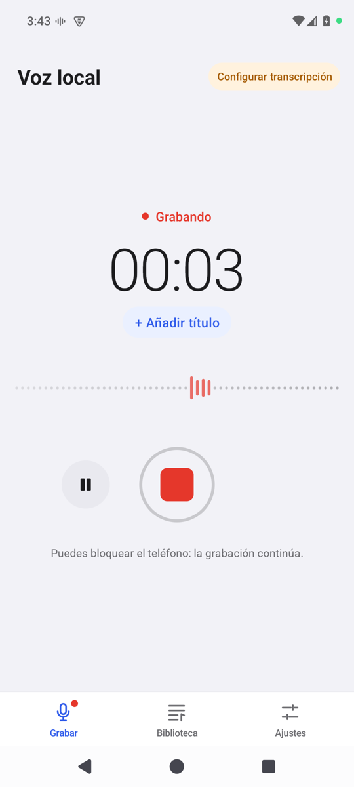
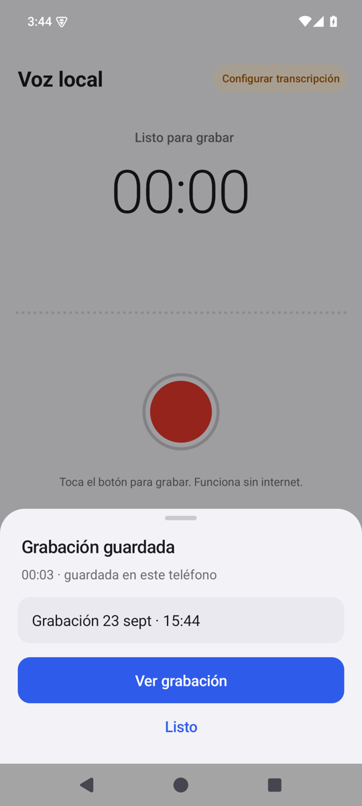
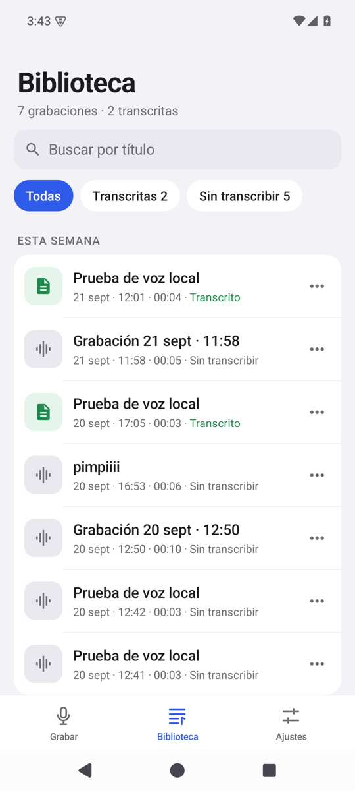
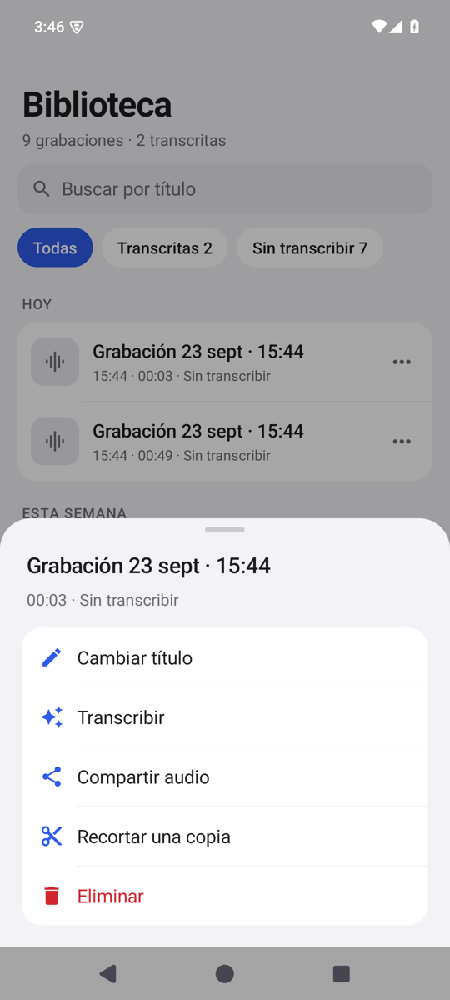
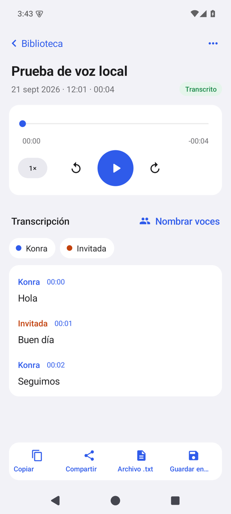
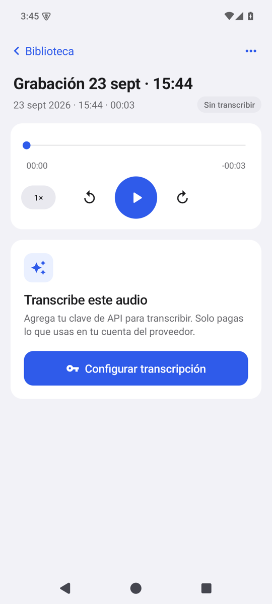
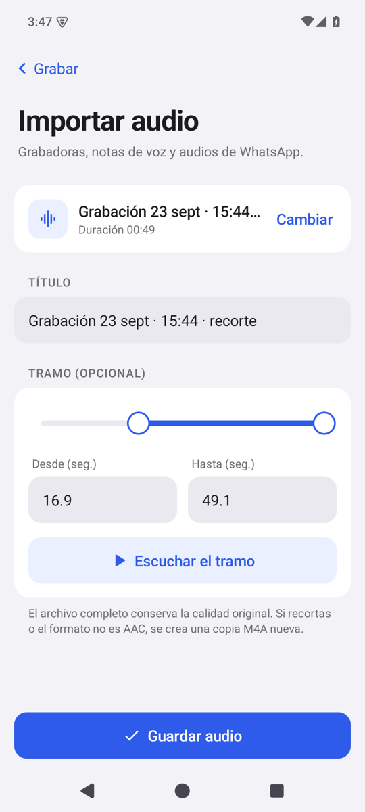
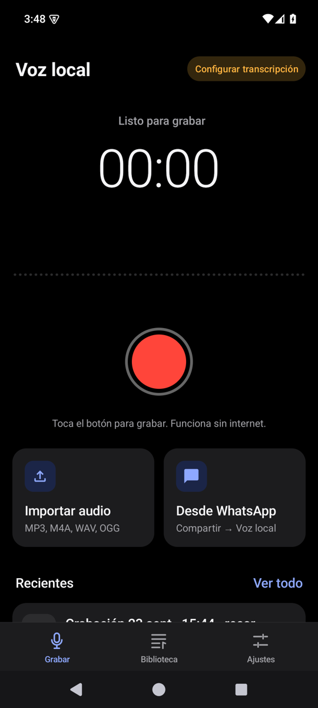

# Criterios de diseño y usabilidad — Voz local

> Documento vivo. Explica **qué** se decidió en el rediseño 0.4, **por qué**, y **cómo** seguir iterando sin perder coherencia.
> Si cambias algo de la UI, actualiza este archivo en el mismo commit.

| Antes (0.3) | Después (0.4) |
| --- | --- |
|  |  |

---

## 1. Diagnóstico: por qué la 0.3 se sentía "básica"

Tener una estética más linda no basta. Una app se siente "no pensada" cuando **obliga a pensar al usuario**. En la 0.3 pasaban estas cosas:

| Síntoma | Por qué molesta | Qué hicimos |
| --- | --- | --- |
| Todo eran botones rectangulares iguales ("Escuchar", "Opciones", "Transcribir" en cada tarjeta) | Sin jerarquía, el ojo no sabe qué es importante | Una sola acción principal por pantalla; el resto va en menús o en acciones secundarias |
| Diálogos del sistema (AlertDialog) y desplegables (Spinner) | Se ven "de Android 2015" y cortan el flujo | **Hojas inferiores** propias, con el mismo estilo que la app |
| Se pedía el título **antes** de grabar | Hay fricción justo cuando el usuario quiere capturar algo rápido | Grabar es **un toque**. El título se pone mientras se graba o al terminar |
| El medidor de audio eran puntos que casi no se movían | No se percibe que "está grabando de verdad" (pedido explícito del usuario) | Onda en vivo en escala de decibeles, halo reactivo en el botón y punto "REC" que parpadea |
| Estado de transcripción como texto suelto | Hay que leer para entender | Ícono + color + texto (**3 señales**) en cada fila, con filtros por estado |
| Ajustes como un formulario largo con párrafos | Abruma e intimida | Lista agrupada estilo iOS: cada fila muestra su valor y la explicación va en el pie del grupo |
| Faltaba la clave de API y solo se veía un mensaje de error | Callejón sin salida | Cada error ofrece la salida: "Configurar ahora" lleva directo al campo de la clave |
| El reproductor estaba en un diálogo y la transcripción en otra pantalla | La información de un mismo audio queda repartida | **Pantalla de detalle** con reproductor, estado y transcripción juntos; tocar un tiempo lo reproduce |

---

## 2. Principios

Son 7 reglas para decidir cualquier cambio. Si una propuesta no cumple alguna, hay que justificarlo.

1. **Una acción principal por pantalla.** Grabar → el botón rojo. Detalle → Transcribir (o leer). Importar → Guardar. Todo lo demás es secundario y se ve más discreto.
2. **Mostrar el estado real, nunca inventarlo.** La onda solo se mueve con sonido real; "En proceso" muestra la etapa exacta ("Enviando audio · bloque 1 de 3"). Si no sabemos algo, no lo mostramos.
3. **Jerarquía con tipografía y espacio, no con cajas y colores.** Títulos grandes, texto secundario gris, mucho aire. El color se reserva para **significado** (rojo = grabar/peligro, verde = listo, azul = acción).
4. **Pedir lo mínimo, en el momento justo.** El título después de grabar. La clave solo cuando se transcribe por primera vez. Los permisos se piden con una explicación previa.
5. **Todo error tiene una salida.** Cada mensaje de error viene con el botón que lo resuelve (Reintentar, Configurar, Abrir ajustes).
6. **Consistencia por sistema, no por memoria.** Colores, tamaños y componentes salen de `AppTheme` y `Ui`. Nunca se escribe un color o un tamaño "a mano" dentro de una pantalla.
7. **Accesible por defecto.** Áreas táctiles de al menos 48 dp, contraste AA, descripciones para lectores de pantalla y estados anunciados. La accesibilidad no es opcional.

---

## 3. Referencias e inspiración

| Referencia | Qué tomamos | Qué **no** tomamos |
| --- | --- | --- |
| **Apple Notas de Voz** | Botón circular que se transforma en cuadrado; onda en vivo; minimalismo en el momento de grabar | La lista en la misma pantalla que la grabación: aquí el usuario pidió que "lo #1 sea grabar o subir" |
| **Ajustes de iOS** | Listas agrupadas, ícono en un cuadrado de color, valor a la derecha y chevron | — |
| **Capturas de "1Transcribe"** (carpeta `2026_09_20 Mejoras…`) | Acciones de importar visibles en el inicio, hablantes con colores, chips de formatos, exportación a la vista | Métrica de "99 % accurate" (no la podemos medir; violaría el principio 2) y el resumen con IA (queda como idea, ver §9) |
| **Material 3** | Hojas inferiores, retroalimentación táctil, modo oscuro verdadero | Componentes de la librería: la app no tiene dependencias, así que los construimos de forma nativa |

---

## 4. Tokens (fuente única: `AppTheme.java`)

### Color — se nombra por **función**, no por tono

| Token | Claro | Oscuro | Uso |
| --- | --- | --- | --- |
| `background` | `#F2F2F7` | `#000000` | Fondo de pantalla (gris muy suave para que las tarjetas blancas "floten") |
| `surface` | `#FFFFFF` | `#1C1C1E` | Tarjetas, grupos, barra de pestañas |
| `fill` | `#E9E9EF` | `#2C2C2E` | Campos, búsqueda, botones secundarios |
| `ink` / `muted` / `faint` | `#1C1C1E` / `#6C6C70` / `#AEAEB2` | `#F5F5F7` / `#A1A1A6` / `#636366` | Texto principal / secundario / decorativo (faint **no** se usa para texto importante) |
| `accent` | `#2F5BEA` | `#8EA8FF` | Enlaces, íconos de acción, selección |
| `primaryFill` | `#2F5BEA` | `#3D63F5` | Fondo del botón principal (con texto blanco, contraste ≥ 4.5:1) |
| `record` | `#E5372B` | `#FF453A` | **Solo** para grabar. Nunca como color decorativo |
| `success` / `warning` / `danger` | verde / ámbar / rojo | versiones claras | Estados: transcrito / falta configurar / error |
| `*Soft` | tintes suaves | tintes oscuros | Fondos de chips e íconos de estado |
| `speakers[6]` | 6 tonos | 6 tonos claros | Color estable por hablante en la transcripción |

**Regla:** para cualquier color nuevo se crea un token con nombre de función en ambos temas. Si solo se define en claro, el modo oscuro se rompe.

### Tipografía (sp) — pocos tamaños y bien diferenciados

| Estilo | Tamaño/peso | Dónde |
| --- | --- | --- |
| `LARGE_TITLE` | 32 bold | Título de pantalla raíz (Biblioteca, Ajustes, Importar) |
| `TITLE` | 24 bold | Marca en inicio, título en detalle |
| `TITLE_SMALL` | 20 medium | Títulos de hojas, estados vacíos |
| `HEADLINE` | 17 medium | Títulos de filas y tarjetas |
| `BODY` | 17 regular | Texto de la transcripción, filas de ajustes |
| `SUBHEAD` / `CALLOUT` | 15 / 16 | Descripciones |
| `FOOTNOTE` | 13 | Metadatos, pies de grupo |
| `CAPTION` / `SECTION` | 12 / 13 medium | Chips / encabezados de sección en MAYÚSCULAS |

El cronómetro usa **dígitos tabulares** (`tnum`) para que los números no "bailen" al cambiar.

### Espacio, radios y movimiento
- Espacios en **múltiplos de 4 dp**: `S1=4, S2=8, S3=12, S4=16, S5=20, S6=24, S8=32, S10=40`. El margen de pantalla es 16.
- Radios: `R_SMALL 10` · `R_CONTROL 14` (botones y campos) · `R_CARD 18` · `R_SHEET 28`.
- Movimiento: `MOTION_FAST 120ms` (presionar), `MOTION_BASE 220ms` (aparecer), `MOTION_SLOW 360ms` (transformar el botón de grabar). Si algo tarda más, parece lento.

---

## 5. Componentes (fuente única: `Ui.java`, `Sheet.java` y vistas propias)

| Componente | Código | Reglas |
| --- | --- | --- |
| Botón | `ui.button(texto, ícono, Style, click)` | `PRIMARY` (1 por pantalla), `TONAL` (secundario destacado), `SECONDARY`, `PLAIN` (enlace), `DESTRUCTIVE`. Alto de 52 dp. Se anuncia como botón a los lectores de pantalla |
| Hoja inferior | `new Sheet(...)` / `screen.sheet(t, m)` | Reemplaza **todos** los diálogos. `.action()` para menús (las destructivas en rojo y al final), `.choice()` para elegir una opción, `.primary()` / `.secondary()` para confirmar |
| Lista agrupada | `ui.group()` + `ui.addRow()` + `ui.listRow()` / `ui.switchRow()` | Separadores con sangría que no cruzan el ícono. El valor actual se muestra a la derecha |
| Fila de grabación | `MainActivity.row()` | Ícono de estado (color + forma) · título en 1 línea · "hora · duración · estado". El menú ⋯ o una pulsación larga abren las opciones |
| Chip | `ui.chip()` / `ui.filter()` | Estados y filtros. Siempre llevan texto, nunca solo color |
| Botón de grabar | `RecordButton` | Círculo → cuadrado (360 ms); el halo reacciona al volumen |
| Onda | `Waveform` | Escala en dB (−48 → 0). En reposo, línea punteada tenue |
| Selector de tramo | `RangeView` | Dos manijas; los campos numéricos se mantienen para mayor precisión y accesibilidad |
| Barra de pestañas | `BottomNav` | 3 destinos fijos con ícono y texto. Un punto rojo en "Grabar" indica que hay una grabación en curso, y en "Biblioteca" que hay transcripciones en proceso |
| Estado de grabación | `RecState` | **Único lugar** que decide texto, color e ícono de cada estado |

---

## 6. Patrones por pantalla

### Grabar (inicio)
  

- El botón rojo está en la **zona del pulgar** y es lo más grande de la pantalla.
- **Modo foco** al grabar: importar y recientes se desvanecen **sin dejar de ocupar su lugar**, así el botón de detener no se mueve. Esto se corrigió después de probarlo: si el botón cambia de lugar, el segundo toque falla.
- "+ Añadir título" aparece solo mientras se graba.
- Al terminar, una hoja **confirma** lo guardado, deja nombrarlo y ofrece el siguiente paso (Transcribir ahora o Ver grabación). Se puede desactivar en Ajustes → "Resumen al terminar".
- El chip de arriba a la derecha resume si la transcripción está lista o qué falta configurar.
- La tarjeta "Transcribiendo «…»" aparece solo cuando hay trabajo (pedido del usuario: "necesito saber que ya lo está procesando").

### Biblioteca
 

- Búsqueda + filtros por estado. Solo se muestran los filtros que tienen elementos.
- Agrupación por fecha: Hoy, Ayer, Esta semana y mes.
- Tocar una fila abre el detalle; ⋯ o una pulsación larga abren las opciones.
- Estado vacío con una acción ("Grabar ahora"), nunca una pantalla en blanco.

### Detalle
 

- Orden: **título → estado → escuchar → leer → exportar**.
- Tocar el tiempo de una intervención lleva el audio a ese punto. Leer y escuchar quedan conectados.
- Los hablantes tienen un color estable y un chip para renombrarlos.
- Barra fija de salida: Copiar · Compartir · .txt · **Guardar en…** (sirve para Google Drive sin iniciar sesión).
- Cada estado (sin transcribir, en proceso, error) tiene su propia tarjeta con **una** acción clara.

### Importar


- Un solo paso visible a la vez: elegir → preparar (progreso) → nombrar y recortar → guardar.
- El recorte con manijas reemplaza al de escribir segundos, pero los campos siguen disponibles.

### Ajustes
 

- Una tarjeta de estado arriba ("Listo para transcribir" o "Falta un paso").
- Cada fila muestra su valor actual; los cambios se hacen en una hoja con ✓.
- La clave se muestra como "Configurada" y nunca vuelve a aparecer (pedido del usuario).

---

## 7. Redacción (microcopy)

- **Tú**, español neutro de Chile, frases cortas.
- Los botones son **verbos**: "Transcribir", "Guardar audio", "Configurar ahora". Se evitan "OK" y "Aceptar".
- Los errores explican **qué pasó + qué hacer**: "No se pudo transcribir · Reintentar".
- Las confirmaciones destructivas nombran el objeto: "¿Eliminar «Reunión lunes»?".
- Se evita la jerga: "clave de API" sí (es lo que ve el usuario en OpenAI); "multipart" o "diarización" no.

---

## 8. Checklist antes de cerrar un cambio de UI

- [ ] ¿Usa solo tokens de `AppTheme` y componentes de `Ui`?
- [ ] ¿Se ve bien en **modo oscuro**? (`adb shell cmd uimode night yes`)
- [ ] ¿La acción principal es obvia y está al alcance del pulgar?
- [ ] ¿Los errores ofrecen una salida?
- [ ] ¿Las áreas táctiles miden al menos 48 dp? ¿Los íconos tienen `contentDescription`?
- [ ] ¿Algún elemento cambia de lugar entre estados? (No debería.)
- [ ] ¿Se registra la acción en `Diagnostics` sin datos personales?
- [ ] ¿Pasa la regresión? `adb shell am instrument -w cl.vozlocal.app.test/cl.vozlocal.app.RecorderSmokeTest`
- [ ] ¿Actualizaste las capturas y este documento?

### Cómo probar rápido en el emulador
```text
.\Abrir-grabadora.ps1                      # abre el emulador preparado
.\build-apk.ps1                            # compila y copia el APK a entrega/
adb install -r -g entrega\Voz-local-0.4.0.apk
adb exec-out screencap -p > captura.png    # captura para comparar
```

---

## 9. Ideas y decisiones pendientes

| Tema | Estado | Nota |
| --- | --- | --- |
| **Google Drive sin iniciar sesión** | Probar en un teléfono real | Opción A (hecha): elegir una carpeta de Drive en Ajustes → Carpeta de copias, o usar "Guardar en…" en cada transcripción. Usa la app de Drive ya instalada. La escritura ahora admite el modo `"w"` que exige Drive. Opción B (futura): un enlace de Google Apps Script como destino de subida, sin OAuth; ese enlace funciona como contraseña |
| Resumen con IA | Idea | Como en las referencias: un botón "Resumir" que use la misma clave (modelo de chat). Hay que mostrar el costo y ser explícito en que envía texto |
| Estimación de costo antes de transcribir | Idea | "≈ US$0,02 por este audio". Requiere mantener actualizada una tabla de precios por modelo |
| Búsqueda dentro de las transcripciones | Idea | Hoy solo se busca por título |
| Exportar SRT o PDF | Idea | SRT es fácil con los tiempos que ya existen |
| Forma de onda real en el reproductor | Idea | Precalcular picos del audio al guardarlo |
| Tipografía propia | Descartado por ahora | Una fuente de marca daría más personalidad, pero suma peso y licencia. Se usa Roboto del sistema con una escala cuidada |

## 10. Registro de decisiones

| Fecha | Decisión | Motivo |
| --- | --- | --- |
| 2026-09-23 | Sin librerías de UI (Material/Compose) | Se mantiene la regla del proyecto: APK de ~170 KB, sin dependencias de ejecución. El kit `Ui` cubre lo necesario |
| 2026-09-23 | Hojas inferiores en vez de diálogos | Consistencia visual, alcance del pulgar y contexto visible |
| 2026-09-23 | Título después de grabar | Reduce la fricción de la acción principal |
| 2026-09-23 | Modo foco sin desplazar el botón | Hallado al probar: el botón de detener se movía y el toque fallaba |
| 2026-09-23 | Pantalla de detalle única | Escuchar y leer el mismo audio sin saltar entre pantallas |
