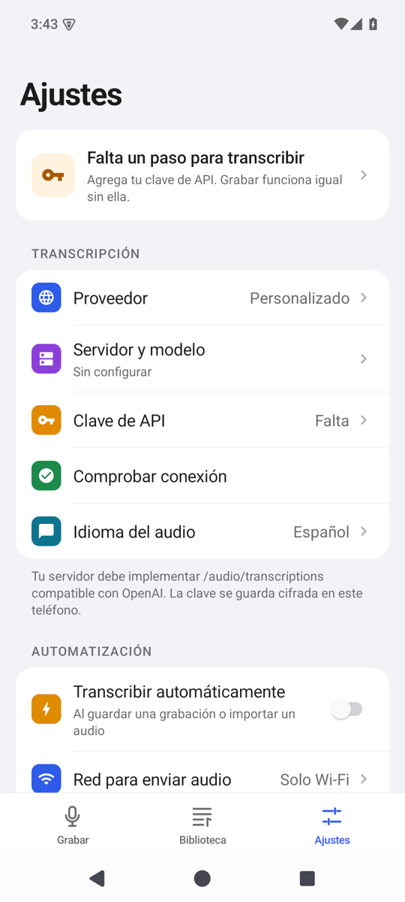
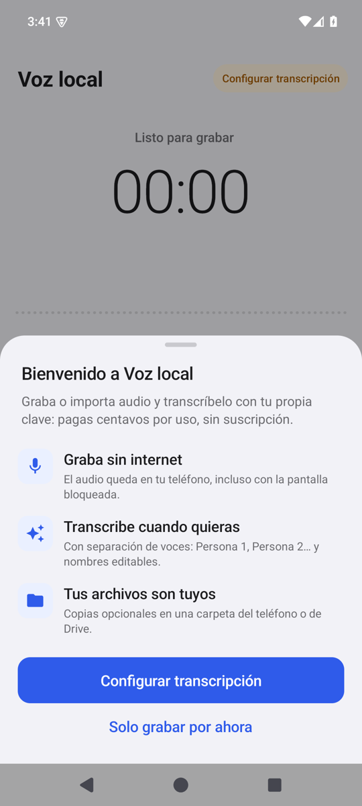
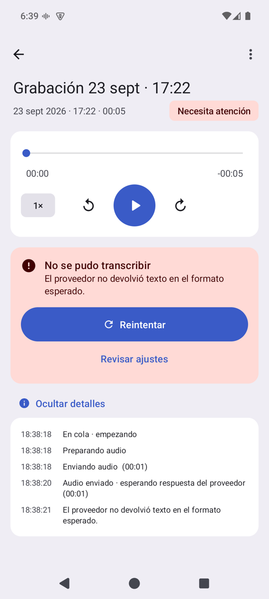
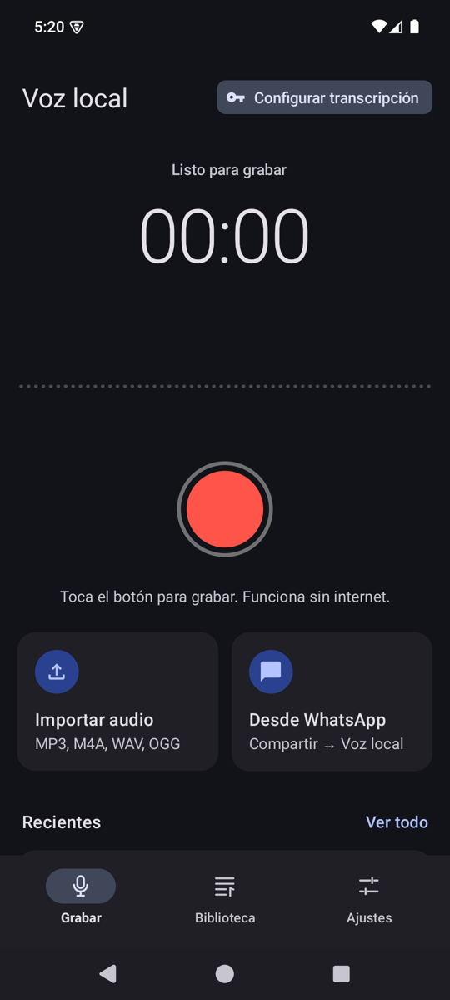

# Criterios de diseño y usabilidad — Voz local

> Documento vivo. Explica **qué** se decidió, **por qué** y **cómo** seguir iterando sin perder coherencia.
> Si cambias algo de la UI, actualiza este archivo en el mismo commit.

**Sistema de diseño: [Material 3](https://m3.material.io)**, el lenguaje oficial de Android, implementado de forma nativa (sin la librería de Material). Un solo color de marca (azul), neutros de la misma familia y el rojo reservado para grabar y para errores.

| 0.3 (antes) | 1.ª iteración 0.4: estilo iOS | 0.4: Material 3 |
| --- | --- | --- |
|  |  |  |
| Botones iguales, sin jerarquía | Mejor estructura, pero **"muy colorinche"**: un color por ícono y verde/naranja/violeta mezclados | Una sola familia de color, íconos monocromos y patrones nativos de Android |

---

## 1. Diagnóstico: por qué la 0.3 se sentía "básica"

Tener una estética más linda no basta. Una app se siente "no pensada" cuando **obliga a pensar al usuario**.

| Síntoma | Por qué molesta | Qué hicimos |
| --- | --- | --- |
| Todo eran botones rectangulares iguales | Sin jerarquía, el ojo no sabe qué es importante | Una sola acción principal por pantalla; el resto va en menús o botones secundarios |
| Diálogos del sistema y desplegables (Spinner) | Se ven anticuados y cortan el flujo | **Hojas inferiores** de Material, con el estilo de la app |
| Se pedía el título **antes** de grabar | Hay fricción justo cuando el usuario quiere capturar algo rápido | Grabar es **un toque**; el título se pone mientras se graba o al terminar |
| El medidor de audio casi no se movía | No se percibe que "está grabando de verdad" | Onda en vivo en escala de decibeles, halo reactivo y punto "REC" que parpadea |
| El estado de transcripción era texto suelto | Hay que leer para entender | Ícono + contenedor tonal + texto, con filtros por estado |
| Ajustes como un formulario largo | Abruma | Lista de Material con subtítulos de sección, valor actual y explicación en el pie |
| Faltaba la clave y solo se veía un error | Callejón sin salida | Cada error ofrece la salida ("Configurar ahora") |
| El reproductor estaba en un diálogo y la transcripción en otra pantalla | La información queda repartida | **Pantalla de detalle** única; tocar un tiempo lo reproduce |

### Y por qué cambiamos de estilo iOS a Material (2.ª iteración)
La primera versión de la 0.4 imitaba iOS (cuadrados de colores en Ajustes, "‹ Volver" con texto, chevrons). El usuario la sintió **"muy colorinche"** y pidió **una línea de diseño estándar pensada para Android**. Tenía razón por tres motivos:
1. **Coherencia con el sistema:** en Android la gente espera la flecha ←, el menú ⋮, la barra de navegación con indicador y las hojas de Material. Imitar iOS se siente "prestado".
2. **Color con significado:** cada color decorativo compite con los que sí significan algo, como grabar o un error. Con una sola familia, el rojo destaca de verdad.
3. **Sistema en lugar de gusto:** Material define **roles de color** con reglas de contraste ya resueltas, así que no hay que inventar combinaciones.

---

## 2. Principios

Son 9 reglas para decidir cualquier cambio.

1. **Una acción principal por pantalla.** Grabar → el botón rojo. Detalle → Transcribir (o leer). Importar → Guardar.
2. **Mostrar el estado real, nunca inventarlo.** La onda solo se mueve con sonido real; "En proceso" muestra la etapa exacta.
3. **Color con significado, no decoración.** Un color de marca para acciones y selección, neutros para todo lo demás, y rojo solo para grabar o error. Si un color no comunica nada, sobra.
4. **Pedir lo mínimo, en el momento justo.** El título después de grabar; la clave recién al transcribir por primera vez.
5. **Todo error tiene una salida.** Cada mensaje viene con el botón que lo resuelve.
6. **Consistencia por sistema, no por memoria.** Colores, tipografía, formas y componentes salen de `AppTheme` y `Ui`. Nunca se escribe un color o un tamaño "a mano" en una pantalla.
7. **Transparencia del proceso.** Si algo tarda, el usuario ve qué está pasando, desde cuándo y por qué espera (red, cargador, batería). Nunca solo un círculo girando.
8. **La pantalla principal no se desplaza.** Grabar es fija: todo lo esencial cabe en una pantalla y los avisos van en el chip de la cabecera, no en tarjetas que empujan el contenido.
9. **Accesible por defecto.** Áreas táctiles de al menos 48 dp, contraste AA (los pares de Material ya lo cumplen), descripciones para lectores de pantalla y estados anunciados.

---

## 3. Referencias

| Referencia | Qué tomamos | Qué **no** tomamos |
| --- | --- | --- |
| **Material 3** (m3.material.io) | Roles de color, escala tipográfica, formas, barra de navegación con indicador, chips de filtro, listas, hojas, botones en forma de píldora, Material You | La librería en sí: la app no tiene dependencias; los componentes se construyen de forma nativa en `Ui` |
| **Grabadora de Google (Pixel)** y **Notas de Voz de Apple** | Botón circular rojo que pasa a cuadrado; onda en vivo; pantalla limpia al grabar | La lista en la misma pantalla de grabación: el usuario pidió que lo principal sea "grabar o subir" |
| **Ajustes de Android** | Subtítulos de sección en color primary, filas con ícono monocromo y valor debajo o a la derecha, grupos redondeados | — |
| **Capturas de "1Transcribe"** (carpeta `2026_09_20 Mejoras…`) | Importar visible en el inicio, colores por hablante, chips de formato, exportación a la vista | "99 % accurate" (no se puede medir) y el resumen con IA (queda como idea) |

---

## 4. Tokens (fuente única: `AppTheme.java`)

### Color: roles de Material 3
Un **color semilla** (azul `#3A5BC7`) genera todo el esquema. Los grises están levemente tintados de azul, así que todo pertenece a la misma familia.

| Rol | Claro | Oscuro | Para qué |
| --- | --- | --- | --- |
| `primary` / `onPrimary` | `#3A5BC7` / blanco | `#B5C4FF` / `#0E2A78` | Botón principal, enlaces, selección, subtítulos de sección |
| `primaryContainer` / `on…` | `#DCE1FF` / `#00164E` | `#2A4190` / `#DCE1FF` | Ícono de estado "Transcrito", avatares de acción |
| `secondaryContainer` / `on…` | `#DDE1F9` / `#151B2C` | `#3F4759` / `#DDE1F9` | Indicador de la barra de navegación, chip de filtro elegido, botón tonal, estado "En proceso", aviso "Falta un paso" |
| `surfaceContainer` | `#EFEDF4` | `#1F1F25` | **Fondo de pantalla** (claro) y barra de navegación |
| `surfaceContainerLowest` | `#FFFFFF` | — | **Tarjetas** en claro (en oscuro, las tarjetas usan `surfaceContainer` sobre `surface` `#121318`) |
| `surfaceContainerHighest` | `#E3E1E9` | `#34343A` | Campos, búsqueda, estado "Sin transcribir" |
| `onSurface` / `onSurfaceVariant` | `#1B1B21` / `#45464F` | `#E4E1E9` / `#C6C5D0` | Texto principal / secundario e **íconos** |
| `outline` / `outlineVariant` | `#767680` / `#C6C5D0` | `#90909A` / `#45464F` | Bordes de chips / divisores |
| `error` / `errorContainer` | `#BA1A1A` / `#FFDAD6` | `#FFB4AB` / `#93000A` | Errores y acciones destructivas |
| `record` (propio) | `#DE3730` | `#FF5449` | **Solo** el botón de grabar y el punto REC |
| `speakers[6]` (propio) | tonos 40 | tonos 80 | Un color estable por hablante, armonizados; el primero es `primary` |

**Reglas de uso**
- Todo texto o ícono sobre un contenedor usa su pareja "on" (`onPrimaryContainer` sobre `primaryContainer`, etc.). Así se garantiza el contraste.
- Los íconos de lista y de menú son **monocromos** (`onSurfaceVariant`). El color va solo en lo que es interactivo o comunica un estado.
- ¿Un color nuevo? Primero busca un rol que sirva. Si de verdad falta, se crea como rol con nombre de función y valores para ambos temas.

**Material You (opcional):** en Android 12+, Ajustes → Apariencia → "Colores de tu fondo de pantalla" reemplaza los roles por la paleta que Android genera del fondo de pantalla (`system_accent1_*`, `system_neutral1_*`…). Está apagado por defecto para mantener la identidad de marca.

### Tipografía: escala de Material 3 (sp, Roboto del sistema)
| Estilo | Tamaño/peso | Dónde |
| --- | --- | --- |
| `HEADLINE_MEDIUM` | 28 | Título grande de pantalla (Biblioteca, Ajustes, Importar) |
| `HEADLINE_SMALL` | 24 | Marca en inicio, título en detalle |
| `TITLE_LARGE` | 22 | Títulos de hojas y estados vacíos |
| `TITLE_MEDIUM` | 16 medium | Títulos de filas y tarjetas |
| `TITLE_SMALL` | 14 medium | Subtítulos de sección (en `primary`) |
| `BODY_LARGE` / `BODY_MEDIUM` / `BODY_SMALL` | 16 / 14 / 12 | Texto, apoyo, notas |
| `LABEL_LARGE` / `LABEL_MEDIUM` | 14 / 12 medium | Botones y chips / barra de navegación |

El cronómetro usa **dígitos tabulares** (`tnum`) para que los números no "bailen" al cambiar. El tracking del cuerpo se redujo un poco respecto de la especificación porque los textos en español son más largos.

### Formas, espacio y movimiento
- **Formas de Material:** small 8 (chips) · medium 12 (campos) · large 16 (tarjetas) · extra-large 28 (hojas) · full (botones en píldora, indicador de navegación, avatares).
- **Espacio:** múltiplos de 4 dp (`S1=4 … S10=40`), con 16 de margen de pantalla y 24 dentro de las hojas.
- **Movimiento:** 100 ms al presionar, 250 ms al aparecer y 400 ms para transformar el botón de grabar.

---

## 5. Componentes (fuente única: `Ui.java`, `Sheet.java`, `BottomNav.java` y vistas propias)

| Componente M3 | Código | Reglas |
| --- | --- | --- |
| **Botones** | `ui.button(texto, ícono, Style, click)` | Píldora de 52 dp. `PRIMARY` = Filled (1 por pantalla), `TONAL` = Filled tonal, `SECONDARY` = Outlined, `PLAIN` = Text, `DESTRUCTIVE` = error |
| **Botón de ícono** | `ui.iconButton(...)` | 48 dp mínimo. Barra superior: ← a la izquierda y ⋮ a la derecha, en `onSurface` / `onSurfaceVariant` |
| **Barra de navegación** | `BottomNav` | 3 destinos con ícono y texto. El activo lleva una píldora `secondaryContainer`. Un punto rojo indica grabación o trabajo en curso |
| **Hoja inferior** | `Sheet` | Fondo `surfaceContainerLow`, asa de 32×4 y esquinas de 28. Menús sin tarjeta interna, íconos neutros y la destructiva en rojo al final. Para elegir entre opciones usa **botones de radio** |
| **Lista** | `ui.group()` + `ui.listRow()` / `ui.switchRow()` | Ícono de 24 dp monocromo, título `BODY_LARGE`, apoyo `BODY_MEDIUM` y valor a la derecha. Sin chevrons (no son de Android) |
| **Subtítulo de sección** | `ui.section()` | `TITLE_SMALL` en `primary`, sin forzar mayúsculas |
| **Chips** | `ui.filter()` / `ui.chip()` / `ui.outlinedChip()` | Esquinas de 8 dp. El filtro sin elegir lleva borde; el elegido va en `secondaryContainer` con ✓ |
| **Avatar / ícono de estado** | `ui.tile()` | Círculo tonal. Estado: Transcrito = `primaryContainer`, En proceso = `secondaryContainer`, Error = `errorContainer`, Sin transcribir = `surfaceContainerHighest` |
| **Interruptor** | dentro de `switchRow` | Riel `primary` + perilla `onPrimary` al activarse; riel `surfaceContainerHighest` al apagarse |
| **Botón de grabar** | `RecordButton` | Círculo → cuadrado (400 ms); halo según el volumen |
| **Onda** | `Waveform` | Escala en dB; en reposo, línea punteada tenue |
| **Selector de tramo** | `RangeView` | Dos manijas; los campos numéricos se mantienen para precisión y accesibilidad |
| **Estado de grabación** | `RecState` | **Único lugar** que decide texto, contenedor, color "on" e ícono de cada estado |

---

## 6. Patrones por pantalla

### Grabar (inicio)
   

- El botón rojo es el elemento más grande y está en la zona del pulgar.
- **Modo foco** al grabar: importar y recientes se desvanecen **sin dejar de ocupar su lugar**, así el botón de detener no se mueve (se corrigió después de probarlo).
- **Pantalla fija, sin desplazamiento.** Si la pantalla es baja, "Recientes" se oculta sola (`fitHome`) para que el botón de grabar nunca quede apretado.
- El chip de la cabecera resume el estado con esta prioridad: falta la clave → **Transcribiendo «…»** (con indicador de carga, abre el detalle) → **Revisar transcripción** (error) → Transcripción lista. Antes era una tarjeta aparte que desplazaba toda la vista.
- Al terminar, una hoja confirma lo guardado, deja nombrarlo y propone el siguiente paso.

### Biblioteca
 

- Búsqueda, chips de filtro de Material (solo los que tienen elementos) y secciones por fecha.
- Tocar una fila abre el detalle; ⋮ o una pulsación larga abren la hoja de opciones.

### Detalle
  

- Orden: título → estado → escuchar → leer → exportar.
- Los nombres de los hablantes van en su color; los tiempos van en gris y, al tocarlos, reproducen desde ese punto.
- Barra fija de salida con acciones neutras: Copiar · Compartir · .txt · **Guardar en…** (sirve para Google Drive).
- **Detalles del proceso** mientras transcribe: paso actual con contador en vivo, progreso de envío (MB), bloques listos, condiciones reales (Wi-Fi, cargador, batería), botón "Empezar ahora" si Android está demorando y una **bitácora** plegable con la hora y duración de cada paso. Al terminar: "tardó X".

### Importar


- Un solo paso visible a la vez; el botón Guardar queda fijo abajo.

### Ajustes
  

- Tarjeta de estado arriba: tonal si falta un paso, neutra si todo está listo.
- Los cambios se hacen en hojas con botones de radio.

---

## 7. Redacción (microcopy)

- **Tú**, español neutro de Chile, frases cortas.
- Los botones son **verbos**: "Transcribir", "Guardar audio", "Configurar ahora".
- Los errores dicen **qué pasó y qué hacer**.
- Las confirmaciones destructivas nombran el objeto: "¿Eliminar «Reunión lunes»?".
- Se evita la jerga técnica ("multipart", "diarización").

---

## 8. Checklist antes de cerrar un cambio de UI

- [ ] ¿Usa solo roles de `AppTheme` y componentes de `Ui`? ¿Ningún color escrito a mano?
- [ ] ¿Los íconos son monocromos salvo que comuniquen un estado?
- [ ] ¿Se ve bien en modo oscuro y con Material You? (`adb shell cmd uimode night yes`)
- [ ] ¿La acción principal es obvia y está al alcance del pulgar?
- [ ] ¿Los errores ofrecen una salida?
- [ ] ¿Las áreas táctiles miden al menos 48 dp? ¿Los íconos tienen `contentDescription`?
- [ ] ¿Algún elemento cambia de lugar entre estados? (No debería.)
- [ ] ¿Pasa la regresión? `adb shell am instrument -w cl.vozlocal.app.test/cl.vozlocal.app.RecorderSmokeTest`
- [ ] ¿Actualizaste las capturas y este documento?

### Cómo probar en el emulador
```text
Abrir-grabadora.cmd                        # doble clic: abre el emulador con ventana y la app
.\build-apk.ps1                            # compila y copia el APK a entrega/
adb install -r -g entrega\Voz-local-0.4.1.apk
adb exec-out screencap -p > captura.png    # captura para comparar
```

---

## 9. Ideas y decisiones pendientes

| Tema | Estado | Nota |
| --- | --- | --- |
| **Google Drive sin iniciar sesión** | Probar en un teléfono real | Opción A (hecha): elegir una carpeta de Drive en Ajustes → Carpeta de copias, o usar "Guardar en…". La escritura admite el modo `"w"` que exige Drive. Opción B (futura): un enlace de Apps Script como destino; ese enlace funciona como contraseña |
| Resumen con IA | Idea | Un botón "Resumir" con la misma clave; mostrar el costo y avisar que envía texto |
| Estimación de costo | Idea | "≈ US$0,02 por este audio"; requiere una tabla de precios actualizada |
| Búsqueda en transcripciones | Idea | Hoy solo se busca por título |
| Exportar SRT o PDF | Idea | SRT es sencillo con los tiempos que ya existen |
| Material 3 Expressive | Evaluar | Formas y movimiento más expresivos (2025). Adoptarlo cuando esté estable en Android |

## 10. Registro de decisiones

| Fecha | Decisión | Motivo |
| --- | --- | --- |
| 2026-09-23 | Sin librerías de UI | APK de ~170 KB, sin dependencias de ejecución. El kit `Ui` cubre lo necesario |
| 2026-09-23 | Hojas inferiores en vez de diálogos | Consistencia, alcance del pulgar y contexto visible |
| 2026-09-23 | Título después de grabar | Reduce la fricción de la acción principal |
| 2026-09-23 | Modo foco sin desplazar el botón | Hallado al probar: el botón de detener se movía y el toque fallaba |
| 2026-09-23 | Pantalla de detalle única | Escuchar y leer el mismo audio sin saltar entre pantallas |
| 2026-09-23 | **De estilo iOS a Material 3** | Pedido del usuario ("muy colorinche", "algo pensado para Android"). Se logra coherencia con el sistema y el color vuelve a tener significado |
| 2026-09-23 | Grabar como pantalla fija; el estado va en el chip | El usuario no quiere que un aviso desplace la pantalla principal |
| 2026-09-23 | Transcripción en servicio en primer plano | Una tarea de fondo se pausa con el teléfono bloqueado (Doze). Con notificación visible sigue funcionando; la tarea diferida queda solo para esperar Wi-Fi o cargador |
| 2026-09-23 | Espera de respuesta proporcional a la duración (4–20 min) | Con un tope fijo de 4 min, los audios largos con separación de voces se cortaban y se reenviaban (y se cobraban) varias veces |
| 2026-09-23 | Material You opcional (apagado por defecto) | Se respeta la identidad de marca y se ofrece la integración con el sistema a quien la quiera |
