# Criterios de diseño y usabilidad — Verbapp (antes Voz local)

> Documento vivo. Explica **qué** se decidió, **por qué** y **cómo** seguir iterando sin perder coherencia.
> Si cambias algo de la UI, actualiza este archivo en el mismo commit.

**Sistema de diseño (0.7.0): «Bosque de vidrio»**, sobre la estructura de [Material 3](https://m3.material.io) (roles de color, escala tipográfica, patrones de Android), implementado de forma nativa (sin la librería de Material). Un verde de marca (`#2F6B58`), tinta negra verdosa para lo principal, vidrio translúcido para las superficies, un degradado blanco → verde de fondo y la letra Outfit en títulos y botones. El naranja rojizo queda solo para «grabando» y los errores. Propuesta completa: [PROPUESTA-0.7.md](PROPUESTA-0.7.md).

| 0.3 (antes) | 1.ª iteración 0.4: estilo iOS | 0.4: Material 3 |
| --- | --- | --- |
| 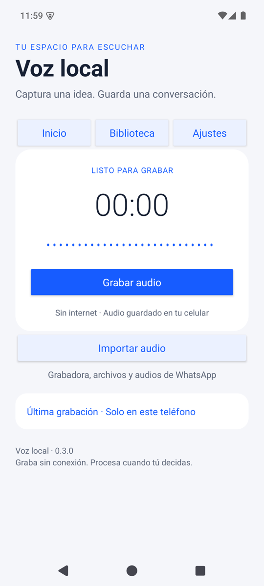 | 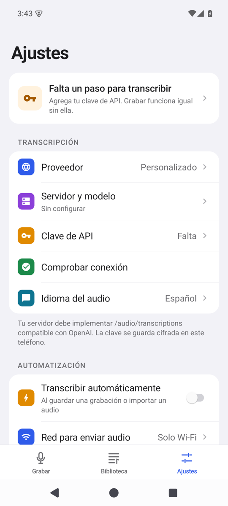 |  |
| Botones iguales, sin jerarquía | Mejor estructura, pero **"muy colorinche"**: un color por ícono y verde/naranja/violeta mezclados | Una sola familia de color, íconos monocromos y patrones nativos de Android |

---

## 1. Diagnóstico: por qué la 0.3 se sentía "básica"

Tener una estética más linda no basta. Una app se siente "no pensada" cuando **obliga a pensar al usuario**.

| Síntoma | Por qué molesta | Qué hicimos |
| --- | --- | --- |
| Todo eran botones rectangulares iguales | Sin jerarquía, el ojo no sabe qué es importante | Una sola acción principal por pantalla; el resto va en menús o botones secundarios |
| Diálogos del sistema y desplegables (Spinner) | Se ven anticuados y cortan el flujo | **Hojas inferiores** de Material, con el estilo de la app |
| Se pedía el título **antes** de grabar | Hay fricción justo cuando el usuario quiere capturar algo rápido | Grabar es **un toque**; el título se pone mientras se graba o al terminar |
| El medidor de audio casi no se movía | No se percibe que "está grabando de verdad" | Onda en vivo en escala de decibeles, halo reactivo y punto "REC" que parpadea |
| El estado de transcripción era texto suelto | Hay que leer para entender | Ícono + contenedor tonal + texto, con filtros por estado |
| Ajustes como un formulario largo | Abruma | Lista de Material con subtítulos de sección, valor actual y explicación en el pie |
| Faltaba la clave y solo se veía un error | Callejón sin salida | Cada error ofrece la salida ("Configurar ahora") |
| El reproductor estaba en un diálogo y la transcripción en otra pantalla | La información queda repartida | **Pantalla de detalle** única; tocar un tiempo lo reproduce |

### Y por qué cambiamos de estilo iOS a Material (2.ª iteración)
La primera versión de la 0.4 imitaba iOS (cuadrados de colores en Ajustes, "‹ Volver" con texto, chevrons). El usuario la sintió **"muy colorinche"** y pidió **una línea de diseño estándar pensada para Android**. Tenía razón por tres motivos:
1. **Coherencia con el sistema:** en Android la gente espera la flecha ←, el menú ⋮, la barra de navegación con indicador y las hojas de Material. Imitar iOS se siente "prestado".
2. **Color con significado:** cada color decorativo compite con los que sí significan algo, como grabar o un error. Con una sola familia, el rojo destaca de verdad.
3. **Sistema en lugar de gusto:** Material define **roles de color** con reglas de contraste ya resueltas, así que no hay que inventar combinaciones.

---

## 2. Principios

Son 9 reglas para decidir cualquier cambio.

1. **Una acción principal por pantalla.** Grabar → el botón verde del micrófono. Detalle → Transcribir (o leer). Importar → Guardar.
2. **Mostrar el estado real, nunca inventarlo.** La onda solo se mueve con sonido real; "En proceso" muestra la etapa exacta.
3. **Color con significado, no decoración.** Verde de marca para grabar, selección y lo que avanza; tinta (negro verdoso) para el botón principal; neutros y vidrio para todo lo demás; naranja rojizo solo para «grabando» y errores. Si un color no comunica nada, sobra.
4. **Pedir lo mínimo, en el momento justo.** El título después de grabar; la clave recién al transcribir por primera vez.
5. **Todo error tiene una salida.** Cada mensaje viene con el botón que lo resuelve.
6. **Consistencia por sistema, no por memoria.** Colores, tipografía, formas y componentes salen de `AppTheme` y `Ui`. Nunca se escribe un color o un tamaño "a mano" en una pantalla.
7. **Transparencia del proceso.** Si algo tarda, el usuario ve qué está pasando, desde cuándo y por qué espera (red, cargador, batería). Nunca solo un círculo girando.
8. **La pantalla principal no se desplaza.** Grabar es fija: todo lo esencial cabe en una pantalla y los avisos van en el chip de la cabecera, no en tarjetas que empujan el contenido.
9. **Accesible por defecto.** Áreas táctiles de al menos 48 dp, contraste AA (los pares de Material ya lo cumplen), descripciones para lectores de pantalla y estados anunciados.

---

## 3. Referencias

| Referencia | Qué tomamos | Qué **no** tomamos |
| --- | --- | --- |
| **Material 3** (m3.material.io) | Roles de color, escala tipográfica, formas, barra de navegación con indicador, chips de filtro, listas, hojas, botones en forma de píldora, Material You | La librería en sí: la app no tiene dependencias; los componentes se construyen de forma nativa en `Ui` |
| **Grabadora de Google (Pixel)** y **Notas de Voz de Apple** | Botón circular rojo que pasa a cuadrado; onda en vivo; pantalla limpia al grabar | La lista en la misma pantalla de grabación: el usuario pidió que lo principal sea "grabar o subir" |
| **Ajustes de Android** | Subtítulos de sección en color primary, filas con ícono monocromo y valor debajo o a la derecha, grupos redondeados | — |
| **Capturas de "1Transcribe"** (carpeta `2026_09_20 Mejoras…`) | Importar visible en el inicio, colores por hablante, chips de formato, exportación a la vista | "99 % accurate" (no se puede medir) y el resumen con IA (queda como idea) |

---

## 4. Tokens (fuente única: `AppTheme.java`)

### Color: roles de Material 3 + roles de Verbapp (0.7.0)
Un **verde de marca** (`#2F6B58`) genera todo el esquema; los grises están levemente tintados de verde. Los nombres de rol de Material se conservan (así todo el código sigue funcionando) y se agregan roles propios de la estética.

| Rol | Claro | Oscuro | Para qué |
| --- | --- | --- | --- |
| `primary` / `brand` | `#2F6B58` | `#93D4BA` / `#4C9A7F` | Botón de micrófono (brand), selección, enlaces, subtítulos de sección, barras de progreso |
| `ink` / `onInk` (propio) | `#121815` / blanco | `#E3F0EA` / `#0F1714` | **Botón principal** (Guardar, Ver grabación, el botón que avanza), destino activo de la barra, snackbar |
| `primaryContainer` / `on…` | `#D4E9DF` / `#0C3427` | `#1F4E40` / `#C4EBDA` | Menta: botón tonal, estado logrado («✓ En 0-Inbox»), círculos de opciones |
| `glass` / `glassStroke` (propio) | blanco 78 % / blanco 95 % | blanco 9 % / blanco 15 % | **Tarjetas y grupos de vidrio** (`p.card` = `glass`) |
| `glassOnVivid` / `onVivid` (propio) | blanco 20 % / blanco | igual | Píldoras y texto sobre el verde intenso (Detener, Pausa, onda) |
| `highlight` (propio) | `#D8EDE3` | `#28503F` | Recuadro detrás de la palabra destacada de un título |
| degradado (propio) | `#FFFFFF` → `#F1F6F4` → `#3E7262` (intenso) o `#D3E4DC` (suave) | `#0D1311` → `#1F4A3D` | Fondo de cada pantalla (`Glass.Backdrop`) |
| `onSurface` / `onSurfaceVariant` | `#111714` / `#4F5D57` | `#E1EAE6` / `#B4C3BC` | Texto principal / secundario e **íconos** |
| `outline` / `outlineVariant` | `#7C8A84` / `#CBD6D1` | `#82918A` / `#36433E` | Bordes / divisores |
| `error` / `errorContainer` | `#BA1A1A` / `#FFDAD6` | `#FFB4AB` / `#93000A` | Errores y acciones destructivas |
| `record` (propio) | `#E4572E` | `#FF7A55` | **Solo** el punto «● Grabando» y avisos de trabajo en curso |
| `speakers[6]` (propio) | verde, ámbar, azul, violeta, rosa, oliva | tonos claros | Un color estable por hablante; el primero es el verde |

**Reglas de uso**
- Todo texto o ícono sobre un contenedor usa su pareja "on" (`onInk` sobre `ink`, `onPrimaryContainer` sobre `primaryContainer`, `onVivid` sobre el verde intenso). Así se garantiza el contraste.
- Los íconos de lista y de menú son **monocromos** (`onSurfaceVariant`). El color va solo en lo que es interactivo o comunica un estado.
- **Una sola tinta por pantalla** (lo principal). El verde de marca es para grabar y para lo que avanza; la menta, para lo logrado.
- ¿Un color nuevo? Primero busca un rol que sirva. Si de verdad falta, se crea como rol con nombre de función y valores para ambos temas.

**Material You:** desde 0.7.0 se retiró («Colores de tu fondo de pantalla»). Verbapp tiene identidad propia (verde + degradado) y los colores del fondo de pantalla la romperían.

### Tipografía: Outfit + Roboto (sp)
**Outfit** (geométrica, fuente variable en `assets/fonts/Outfit.ttf`, licencia SIL OFL) para todo lo que se «mira»: cronómetro, títulos, botones, etiquetas y números. **Roboto** (del sistema) para lo que se «lee» en párrafos: transcripciones y explicaciones.

| Estilo | Tamaño / letra | Dónde |
| --- | --- | --- |
| `DISPLAY_LARGE` | 68 Outfit 500 | Cronómetro al grabar |
| `DISPLAY_SMALL` | 36 Outfit 500 | Saludo (nombre), título mientras grabas |
| `HEADLINE_LARGE` | 32 Outfit 500 | Título grande de pantalla (Biblioteca, Ajustes) |
| `HEADLINE_MEDIUM` / `SMALL` | 28 / 24 Outfit 500 | Título en el detalle / hojas |
| `TITLE_LARGE` / `MEDIUM` / `SMALL` | 22 / 16 / 14 Outfit | Títulos de tarjetas y filas / subtítulos de sección (verde) |
| `ITEM` | 16 Outfit 400 | Título de filas de lista y opciones de menú |
| `BODY_LARGE` / `MEDIUM` / `SMALL` | 16 / 14 / 12 Roboto | Texto de lectura, apoyo, notas |
| `LABEL_LARGE` / `MEDIUM` / `SMALL` | 14 / 12 / 11 Outfit 500 | Botones (15 sp), chips, metadatos |

Los números que cambian usan **cifras de ancho fijo** (`Ui.tabular`, «tnum» de Outfit) para que no «bailen». La **palabra destacada** (`ui.highlightLast`) pone un recuadro menta detrás de la última palabra de un título grande, solo si es corta.

### Formas, espacio y movimiento
- **Formas (0.7.0, más redondas):** 8 (detalles) · 16 (campos) · 24 (tarjetas de vidrio) · 32 (hojas) · píldora (botones, chips, filtros, barra flotante, búsqueda).
- **Espacio:** múltiplos de 4 dp (`S1=4 … S10=40`), con 16 de margen de pantalla y 24 dentro de las hojas.
- **Movimiento:** 100 ms al presionar, 250 ms al aparecer y 400 ms para transformar el botón de grabar.
- **Curvas (0.6.0, Material 3 Expressive):**
  - `EMPHASIZED`, `EMPHASIZED_DECELERATE` y `EMPHASIZED_ACCELERATE` para entradas y salidas.
  - Resortes (`SPATIAL`) solo para posición y tamaño; **nunca rebote en color ni transparencia**.
  - Se respeta «Quitar animaciones» de Android: sin animación.
- **Vibración con significado** (`Ui.haptic(v, Ui.Haptic.X)`):
  - CONFIRM: empezar o detener, ★ Marcar, transcripción lista, guardado en 0-Inbox.
  - REJECT: error o toque ignorado.
  - TOGGLE_ON / TOGGLE_OFF: interruptores.
  - TICK: pasar por una ★ al arrastrar la onda.
  - En Android antiguo se usa la vibración básica.

---

## 5. Componentes (fuente única: `Ui.java`, `Sheet.java`, `BottomNav.java` y vistas propias)

| Componente M3 | Código | Reglas |
| --- | --- | --- |
| **Botones** | `ui.button(texto, ícono, Style, click)` | Píldora de 52 dp con texto en Outfit 15. `PRIMARY` = **tinta** (1 por pantalla), `TONAL` = menta, `SECONDARY` = gris suave (Cancelar, Listo), `PLAIN` = texto verde, `DESTRUCTIVE` = error, `RECORD` = verde de marca y `VIVID` = vidrio blanco sobre el verde intenso (Detener, Pausa). Al presionar se hunden a 0,96 y cierran un poco las esquinas |
| **Botón de dos partes** | `ui.split(texto, ícono, principal, más)` | 52 dp, con 2 dp entre la acción principal y ▾. `setTonal` para el estado «hecho» (`secondaryContainer`). `setBusy` muestra un indicador de carga y `showDone()` lo convierte en ✓. Es el **botón que avanza** del detalle: Transcribir → Revisar voces → Guardar en 0-Inbox → ✓ En 0-Inbox · hh:mm / Actualizar |
| **Botón de ícono** | `ui.iconButton(...)` / `ui.glassButton(...)` / `Screen.barButton(...)` | 48 dp mínimo. En la barra superior, círculos de vidrio: ← a la izquierda y ⋯ a la derecha |
| **Barra de navegación** | `BottomNav` | Cápsula flotante de vidrio con 3 destinos. El activo se abre en una **píldora de tinta con su nombre**; los demás muestran solo el ícono (el nombre lo lee el lector de pantalla). Un punto naranja indica grabación o trabajo en curso. Al grabar se esconde (`Screen.setNavHidden`) |
| **Hoja inferior** | `Sheet` | Blanca (en oscuro, `surfaceContainerLow`), con esquinas de 32, título en Outfit y el fondo desenfocado en Android 12+. Llega hasta el borde de abajo. Con dos botones cortos van lado a lado ([gris] · [tinta]); si no, apilados. `closable()` agrega el ✕. Para elegir entre opciones usa **botones de radio** |
| **Vidrio y fondo (0.7.0)** | `ui.card()`, `ui.group()`, `AppTheme.glass()`, `Glass.Backdrop` | Tarjetas translúcidas con borde tenue y esquinas de 24. El fondo es un degradado (intenso en Grabar y suave en el resto) que pasa por detrás de las barras del sistema. Las listas se desvanecen en los bordes |
| **Marca y detalles (0.7.0)** | `ui.brand()`, `ui.highlightLast()`, `ui.stat()`, `Ui.tabular()` | Logo + «Verbapp» en Outfit inclinado; la última palabra de un título grande en un recuadro menta; datos de resumen («Tu semana»); cifras de ancho fijo para números que cambian |
| **Lista** | `ui.group()` + `ui.listRow()` / `ui.switchRow()` | Ícono de 24 dp monocromo (o en círculo menta, en Ajustes), título `ITEM` (Outfit), apoyo `BODY_MEDIUM` y valor a la derecha. Sin chevrons (no son de Android) |
| **Subtítulo de sección** | `ui.section()` | `TITLE_SMALL` en `primary`, sin forzar mayúsculas |
| **Chips** | `ui.filter()` / `ui.chip()` / `ui.outlinedChip()` | Esquinas de 8 dp. El filtro sin elegir lleva borde; el elegido va en `secondaryContainer` con ✓ |
| **Avatar / ícono de estado** | `ui.tile()` | Círculo tonal. Estado: Transcrito = `primaryContainer`, En proceso = `secondaryContainer`, Error = `errorContainer`, Sin transcribir = `surfaceContainerHighest` |
| **Interruptor** | `ui.switchRow(...)` → `Ui.SwitchRow` | Interruptor real de Material 3: riel de 52×32; perilla de 16 dp apagada y 24 dp encendida, con ✓; vibración TOGGLE |
| **Íconos** | `res/drawable/ic_*` | Material Symbols Rounded, peso 400 y contorno. Rellenos solo play, pausa, detener y la pestaña activa |
| **Botón de grabar** | `RecordButton` | Círculo → cuadrado (400 ms); halo según el volumen |
| **Onda en vivo** | `Waveform` | Barras redondeadas sobre tarjeta (~130 dp). Lo grabado va en `onSurfaceVariant`, lo más nuevo en rojo de grabar, gris en pausa y ★ encima |
| **Onda del reproductor** | detalle (`WaveData`) | Envolvente de 600 puntos: lo escuchado en `primary`, lo que falta en `outlineVariant`, franja fina con el color de quién habla y puntos ★. Tocar o arrastrar mueve el audio |
| **Anillo de avance** | Biblioteca | Progreso real (partes listas o audio procesado), nunca un porcentaje inventado |
| **Selector de tramo** | `RangeView` | Dos manijas; los campos numéricos se mantienen para precisión y accesibilidad |
| **Estado de grabación** | `RecState` | **Único lugar** que decide texto, contenedor, color "on" e ícono de cada estado |
| **Snackbar** | `Screen.snackbar(texto, acción, run)` | Confirma un cambio y ofrece **Deshacer** por 6 s. Colores invertidos (`inverseSurface`, `inverseOnSurface`, acción en `inversePrimary`). Va sobre la zona inferior fija, sin tapar el contenido. Se usa en vez de pedir confirmación para cambios reversibles |
| **Opción con persona** | `Sheet.choice(texto, apoyo, elegido, color, run)` | Radio + punto del color de la voz: el mismo punto que en chips y encabezados, para reconocer a cada persona de un vistazo |

---

## 6. Patrones por pantalla

### Grabar (inicio)
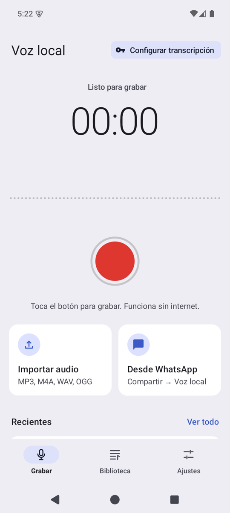 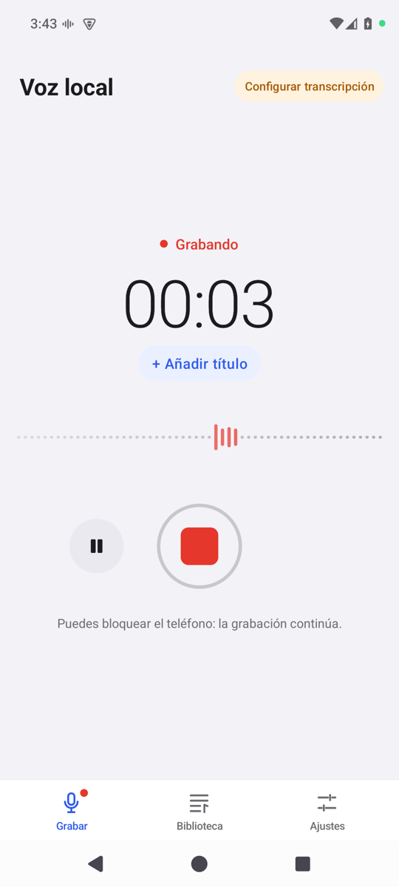 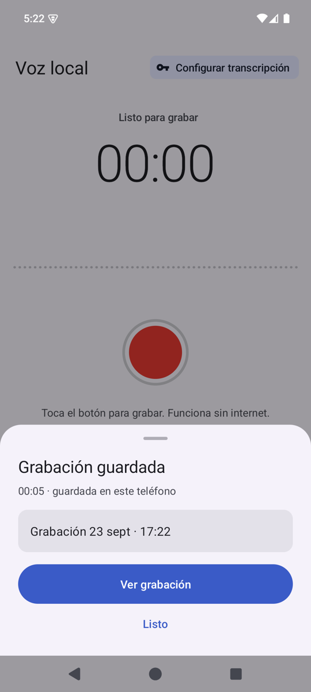 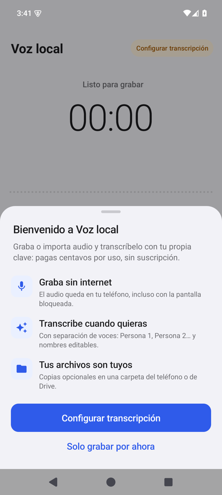

- El botón rojo es el elemento más grande y está en la zona del pulgar.
- **Grabando (0.6.0):** tres controles fijos, [Pausa] [Detener] [★ Marcar con contador]. Detener ocupa exactamente el lugar del botón de grabar y se ignora durante el primer segundo, para evitar grabaciones accidentales. En pausa, el tiempo parpadea, la onda queda gris y «Reanudar» se destaca. «Añadir título» sigue disponible como botón secundario.
- **Cabecera:** si todo está bien, una línea tranquila «✓ Listo para transcribir». Si hay una transcripción lista sin abrir, dice «Revisar · «título»» y la abre.
- **«Última grabación»** reemplaza la tarjeta de WhatsApp, con el mismo tamaño para que la pantalla siga fija. Muestra su estado y UN botón con el siguiente paso (`Next`).
- Al detener, la hoja «Grabación guardada» abre el título con el teclado listo, muestra la fecha como prefijo fijo y ofrece «Ver grabación».
- **Modo foco** al grabar: importar y recientes se desvanecen **sin dejar de ocupar su lugar**, así el botón de detener no se mueve (se corrigió después de probarlo).
- **Pantalla fija, sin desplazamiento.** Si la pantalla es baja, "Recientes" se oculta sola (`fitHome`) para que el botón de grabar nunca quede apretado.
- El chip de la cabecera resume el estado con esta prioridad: falta la clave → **Transcribiendo «…»** (con indicador de carga, abre el detalle) → **Revisar transcripción** (error) → Transcripción lista. Antes era una tarjeta aparte que desplazaba toda la vista.
- Al terminar, una hoja confirma lo guardado, deja nombrarlo y propone el siguiente paso.

### Biblioteca
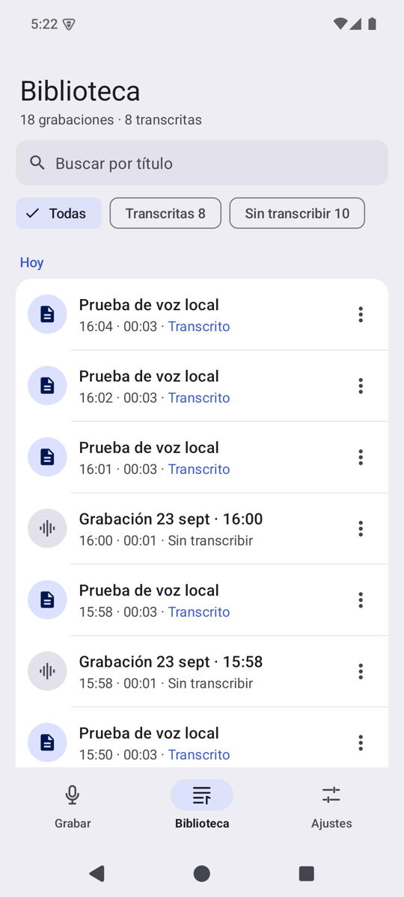 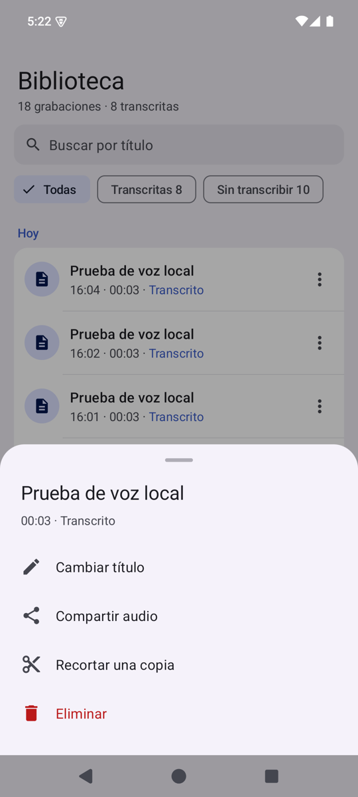

- Búsqueda, chips de filtro de Material (solo los que tienen elementos) y secciones por fecha.
- **Filas de 3 líneas (0.6.0):**
  1. título;
  2. el comienzo del texto («Konrad: la idea es…») o el estado;
  3. duración en palabras · personas con su color · «✓ En 0-Inbox» o «Por guardar».
- Lo terminado va en tono neutro. Solo se destaca lo que pide acción: el anillo de avance, un error con «Reintentar» en la misma fila, o un punto «nuevo».
- Filtros: Todas · Por guardar · En proceso · Sin transcribir · Con error. Tocar el filtro activo lo quita, y «Sin resultados» ofrece «Quitar filtro».
- Tocar una fila abre el detalle; ⋮ o una pulsación larga abren la hoja de opciones.

### Detalle
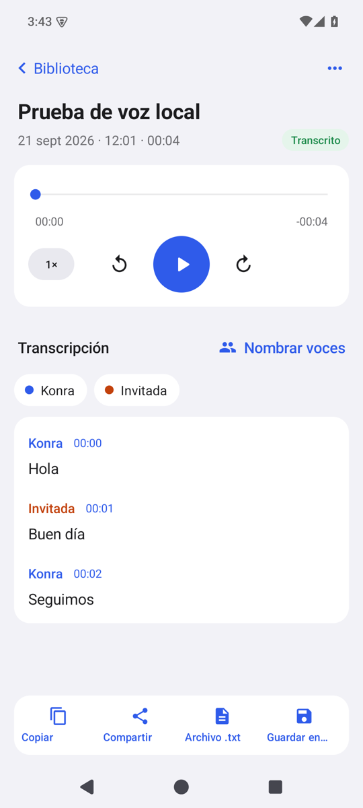 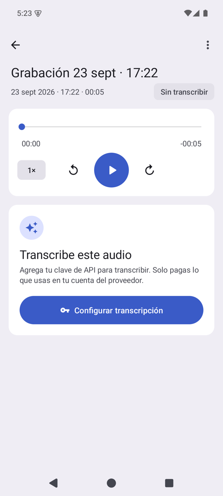 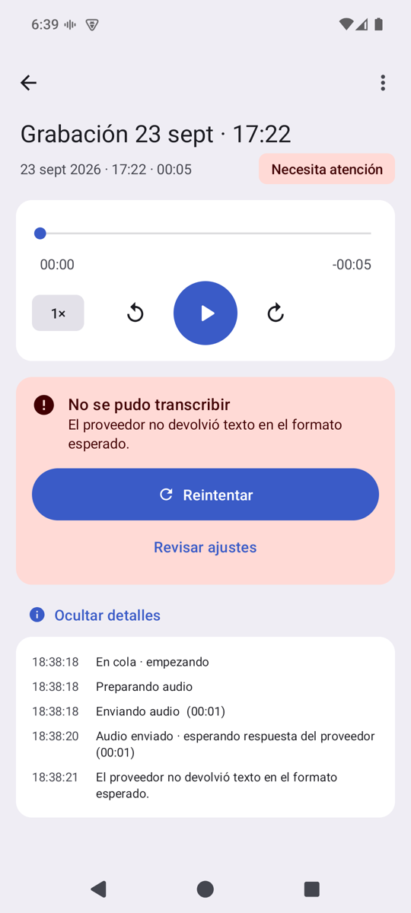

- **Detalle como documento (0.6.0):**
  - Orden: título con lápiz → ficha (personas con su % y «voces revisadas») → **Nota para tu segundo cerebro** (generada por IA, se marca como tal) → Momentos ★ → transcripción a todo el ancho.
  - Abajo, fijo: onda del reproductor, controles compactos y **un botón principal que avanza**.
  - Las demás salidas (copiar, compartir, .txt, .md, otra carpeta, volver a transcribir) van en ▾.
- **La transcripción sigue al audio** mientras suena. Si el usuario se desplaza, aparece «↓ Volver a lo que suena». Los separadores de parte solo se ven al corregir voces.
- Pie en palabras: «Transcrito el 23 sept · tardó 2 min · ≈ US$0,02». El nombre del modelo va solo en los detalles del proceso.
- (Hasta 0.5.x) Orden: título → estado → escuchar → leer → exportar.
- Los nombres de los hablantes van en su color; los tiempos van en gris y, al tocarlos, reproducen desde ese punto.
- Barra fija de salida con acciones neutras: Copiar · Compartir · .txt · **Guardar en…** (sirve para Google Drive).
- **"¿Separar voces?"** al transcribir (configurable: preguntar, siempre, nunca). Cada opción muestra para qué sirve, su velocidad y el costo estimado de ese audio: el usuario decide con información, no a ciegas.
- **Métricas** en la tarjeta de proceso: tiempo total y restante en vivo, audio procesado, velocidad (× tiempo real), costo estimado hasta ahora y total, tokens, datos enviados y texto recibido. Al terminar, el mismo resumen queda dentro de "Ver detalles del proceso". Los costos se rotulan como estimados con la fecha de la tarifa pública (principio 2: no inventar).
- **Corregir voces sin modo edición** (0.5.0). El nombre de color de cada intervención se puede tocar y abre «¿Quién habla aquí?»:
  - escuchar solo ese tramo sin cerrar la hoja;
  - elegir a la persona correcta (radio con su color) u «Otra persona»;
  - «Intercambiar A y B desde aquí», hasta el final o solo en ese bloque, que arregla un cruce con un toque;
  - «Corregir solo una frase».
  Los chips de personas abren la ficha de cada una: escuchar una muestra, cambiar el nombre, «Es la misma persona que…» y ver solo sus intervenciones. **Mismo nombre = misma persona**: se unen de verdad, con un solo chip y un solo color. Cada cambio muestra un snackbar con **Deshacer**, y en «Nombrar voces» existe **Restaurar voces originales**.
- **Números y colores fijos**: al corregir, nadie cambia de número ni de color (el orden se congela en la primera corrección).
- **Escuchar sin perder el lugar**: tocar la hora reproduce ahí mismo (sin subir al reproductor) y la intervención que suena se resalta en `primaryContainer`.
- **Aviso honesto**: «Voces separadas automáticamente: pueden tener errores» hasta que el usuario revisa las voces. Un separador discreto marca dónde empieza cada bloque.
- **Detalles del proceso** mientras transcribe: paso actual con contador en vivo, progreso de envío (MB), bloques listos, condiciones reales (Wi-Fi, cargador, batería), botón "Empezar ahora" si Android está demorando y una **bitácora** plegable con la hora y duración de cada paso. Al terminar: "tardó X".

### Importar
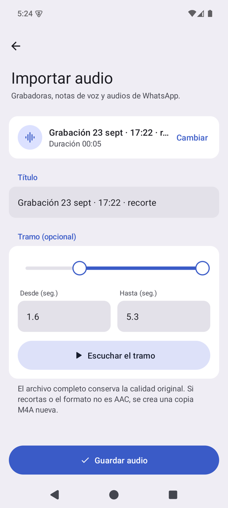

- Un solo paso visible a la vez; el botón Guardar queda fijo abajo.
- (0.6.0) Abre directo el selector de archivos. Salir de la pantalla **no** cancela la importación, que sigue en segundo plano con barra de avance. El título va sin extensión, y la ayuda de WhatsApp está aquí.

### Ajustes
 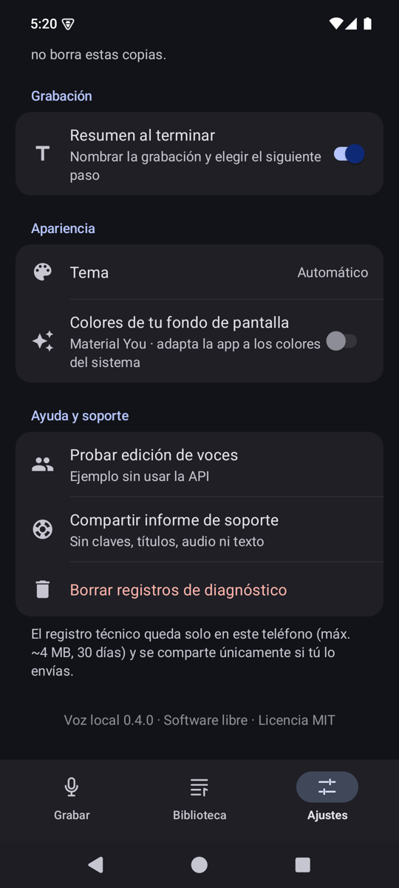 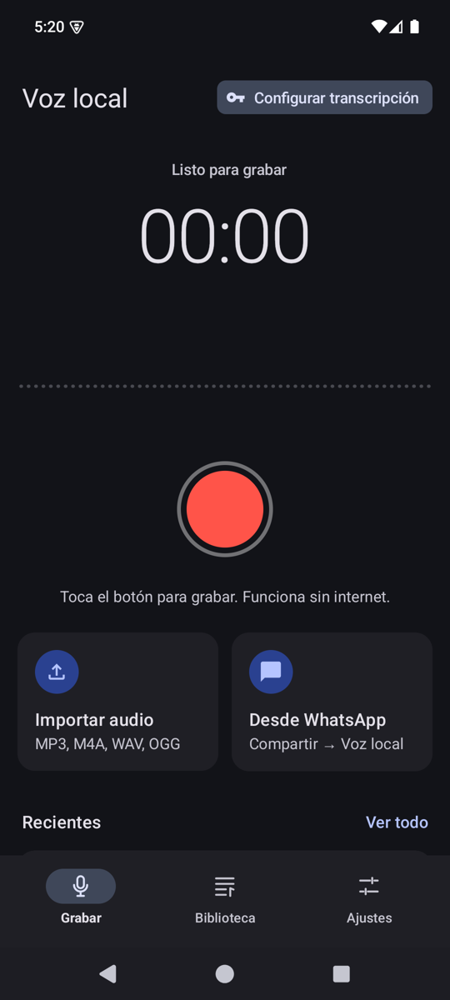

- Tarjeta de estado arriba: tonal si falta un paso, neutra si todo está listo.
- **Orden (0.6.0):** Tu flujo (0-Inbox, nota, IA de la nota, automático, fecha, voces conocidas) → Servicio de transcripción → Energía y red → Copias → Apariencia → Ayuda y soporte (novedades y versiones, informe; «Borrar registros» sin rojo).
- Una línea de apoyo por fila; lo largo va en «Más información».
- «Comprobar conexión» muestra el resultado en la misma fila, sin una hoja que haya que cerrar.
- Los cambios se hacen en hojas con botones de radio.
- **(0.8.0) Tus métricas:** una tarjeta arriba de todo (antes de «Tu flujo») con el resumen, que abre la pantalla «Tus métricas». Sin grabaciones, la tarjeta invita a grabar en vez de mostrar ceros.
- **(0.8.0) Tu IA (OpenRouter):** sin elección de proveedor. Orden: Clave de OpenRouter → Comprobar conexión → modelo con voces → modelo solo texto → Separar voces → IA de la nota → Idioma. Primero lo que hace falta para empezar, después lo que se afina. «Comprobar conexión» muestra el saldo («✓ Clave válida · quedan US$4,20»), o «aún sin créditos» si la cuenta no los tiene (entonces no se guarda ningún saldo). Los montos se escriben siempre igual, sin espacio tras «US$» (`Pricing.usd`, `SettingsActivity.money`).
- **(0.8.0) Energía y red:** con «Solo Wi-Fi», la fila recuerda que cada transcripción en espera ofrece «Usar datos móviles ahora». Ese botón principal va en el detalle (con el tamaño aproximado: «≈X MB») y como acción en la notificación «Esperando Wi-Fi»; vale solo para esa grabación y no cambia el ajuste.
- **(0.8.0) Hoja de modelos de OpenRouter:** arriba, una franja con el estado de la lista («Lista actualizada hace 2 h · 24 modelos», «Actualizar lista», carga, y el error en tono de error con «Reintentar»); después la tarjeta menta «Automático» con la píldora «Recomendado» y el modelo que usa hoy; luego «Probados por Verbapp» y «Nuevos en OpenRouter». Cada modelo lleva nombre, autor, una píldora («Separa voces» en menta, «Solo texto» en gris, «Sin confirmar» y «Nuevo · sin probar» solo con borde, «Se retira el…») y el precio por hora alineado a la derecha, con «≈» si es de referencia. Las píldoras bajan de línea si no caben (contenedor `Flow`).
- **(0.8.0) IA de la nota:** una familia de OpenRouter (Claude, GPT o Gemini, con alias «-latest»: siempre la versión más nueva) u «Otro modelo de OpenRouter…» escrito a mano; la nota muestra cuál respondió.
- **(0.8.0) Ayuda y soporte** suma «Ver la bienvenida».

### Bienvenida (0.8.0)
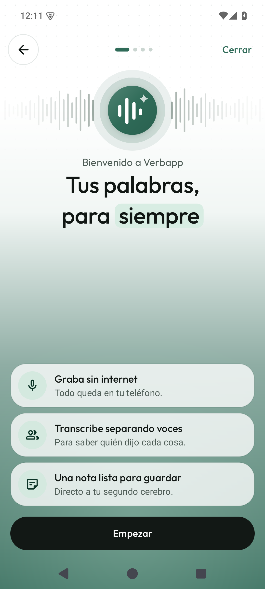 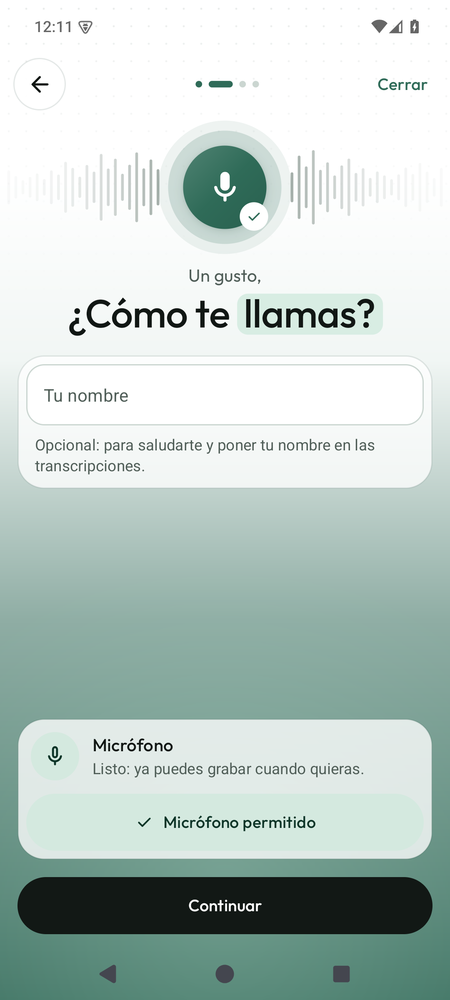 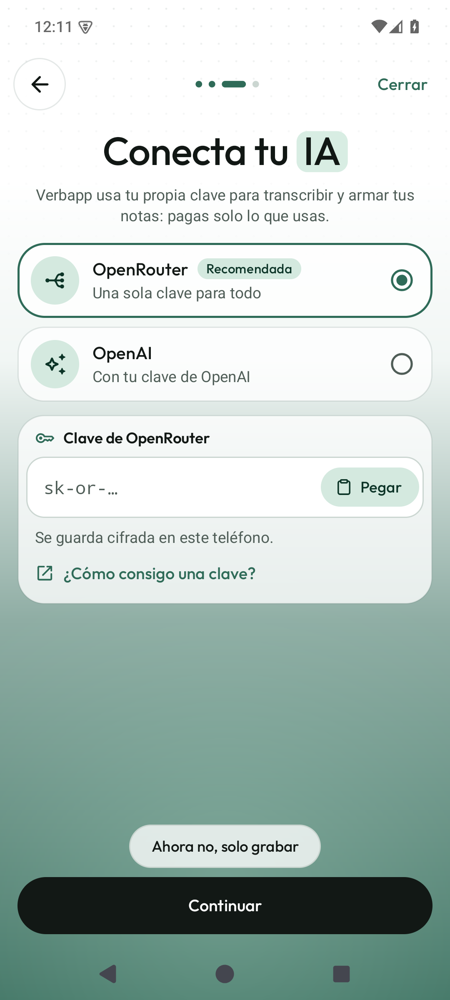 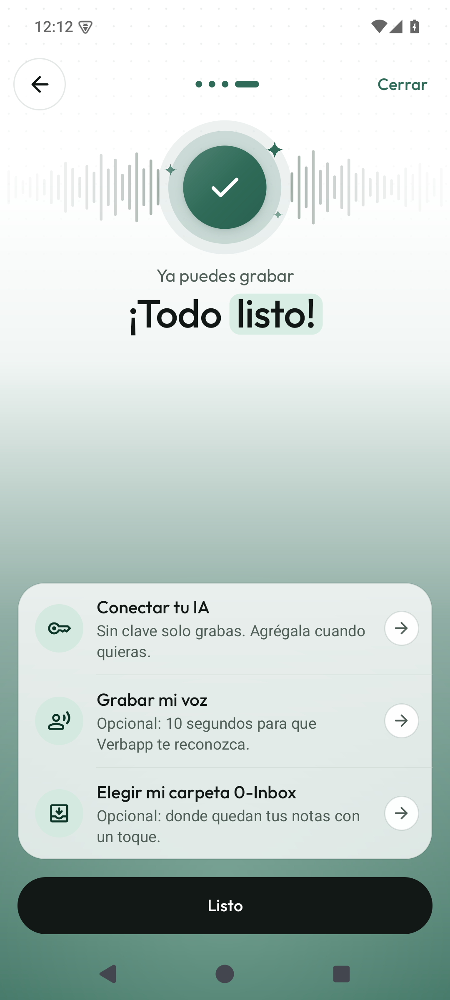

- Solo en la primera instalación (`welcomed=false`); quien actualiza ve «Novedades». Se repite desde Ajustes → Ayuda y soporte, sin tocar claves ni ajustes guardados.
- Pantalla completa sobre el fondo intenso, sin barra de pestañas. Marco fijo: ← (desde el paso 2), puntos de avance y «Saltar» arriba; un solo botón de tinta abajo, que no cambia de lugar.
- Cuatro pasos cortos: Bienvenida (tres beneficios en vidrio) → Tú (nombre opcional, permiso de micrófono y «Con la pantalla bloqueada») → Conecta tu IA (solo OpenRouter; campo oculto con «Pegar»; «Ahora no, solo grabar») → Listo (estado de la clave, «Grabar mi voz», «Elegir mi carpeta 0-Inbox»).
- **«Con la pantalla bloqueada»** (tercera ronda): pide quitar la optimización de batería (`Battery.request`) y, en marcas que la vuelven a activar (vivo y otras), muestra los pasos de su menú (`Battery.makerSteps`). Muestra ✓ si ya está permitido y se puede saltar. Nace del diagnóstico del 2026-10-01: sin este permiso, Android pausó una transcripción 45 min.
- Nada bloquea: la clave se comprueba en segundo plano mientras ya se avanza, y el resultado queda también en Ajustes → «Comprobar conexión». La clave nunca se vuelve a mostrar ni se registra.

### Tus métricas (0.8.0)
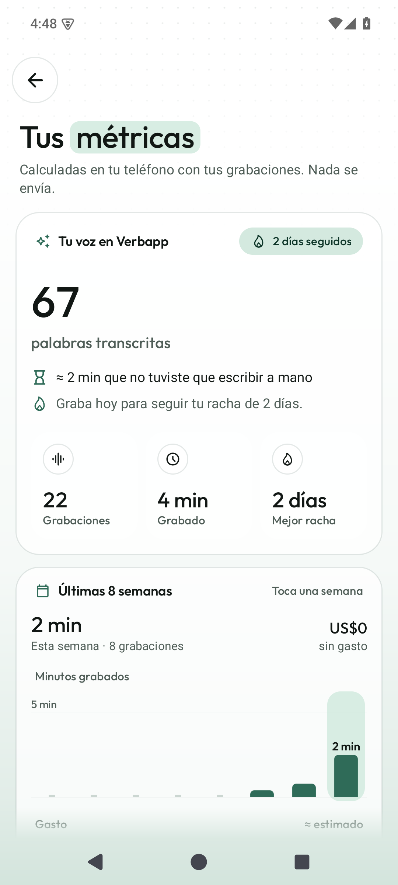 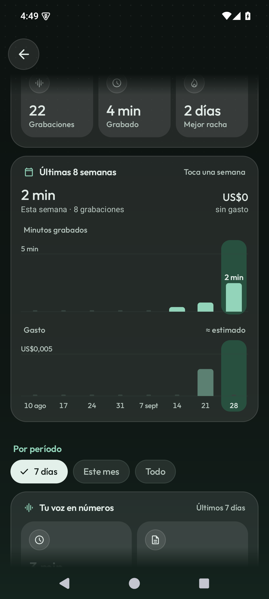 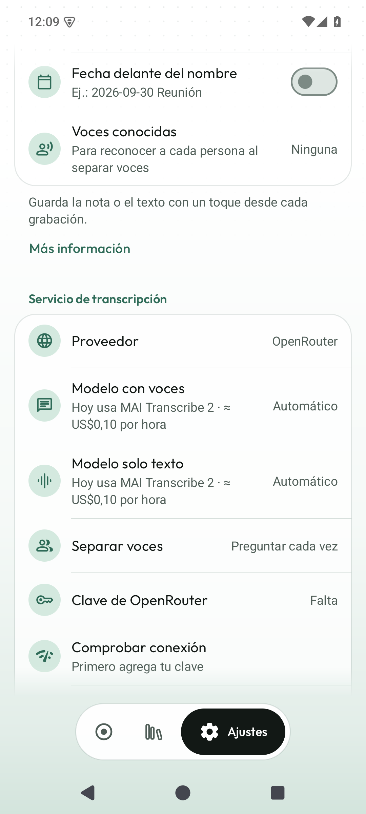

- Se abre desde la tarjeta de Ajustes o desde «Tu semana» en Grabar. Desde «Tu semana» abre en «7 días», lo mismo que esa tarjeta resume; desde Ajustes, en el último período elegido.
- Una sola fila de filtros (7 días · Este mes · Todo) manda sobre todo lo de abajo: tiempo hablado, grabaciones, palabras y notas; 8 semanas en barras (se ajustan con el gesto de TalkBack); racha y mejor racha; mapa de a qué hora grabas; con quién conversas; y gasto por modelo, con lo cobrado y lo estimado («≈») por separado.
- Todo se calcula en el teléfono (`Metrics.compute`) y se dice: «Nada se envía». Sin grabaciones en el período, una invitación en vez de ceros.

---

## 7. Redacción (microcopy)

- **Tú**, español neutro de Chile, frases cortas.
- Los botones son **verbos**: "Transcribir", "Guardar audio", "Configurar ahora".
- Los errores dicen **qué pasó y qué hacer**.
- Las confirmaciones destructivas nombran el objeto: "¿Eliminar «Reunión lunes»?".
- Se evita la jerga técnica ("multipart", "diarización").

---

## 8. Checklist antes de cerrar un cambio de UI

- [ ] ¿Usa solo roles de `AppTheme` y componentes de `Ui`? ¿Ningún color escrito a mano?
- [ ] ¿Los íconos son monocromos salvo que comuniquen un estado?
- [ ] ¿Se ve bien en modo oscuro y con Material You? (`adb shell cmd uimode night yes`)
- [ ] ¿La acción principal es obvia y está al alcance del pulgar?
- [ ] ¿Los errores ofrecen una salida?
- [ ] ¿Las áreas táctiles miden al menos 48 dp? ¿Los íconos tienen `contentDescription`?
- [ ] ¿Algún elemento cambia de lugar entre estados? (No debería.)
- [ ] ¿Pasa la regresión? `adb shell am instrument -w cl.verbapp.app.test/cl.vozlocal.app.RecorderSmokeTest`
- [ ] ¿Actualizaste las capturas y este documento?
- [ ] ¿Agregaste la entrada de la versión en `app/src/main/assets/novedades.json`? Van de 3 a 6 puntos en lenguaje simple, con formato «Titular: detalle».

### Cómo probar en el emulador
```text
Abrir-grabadora.cmd                        # doble clic: abre el emulador con ventana y la app
.\build-apk.ps1                            # compila y copia el APK a entrega/
adb install -r -g entrega\Voz-local-0.4.3.apk
adb exec-out screencap -p > captura.png    # captura para comparar
```

---

## 9. Ideas y decisiones pendientes

| Tema | Estado | Nota |
| --- | --- | --- |
| **Google Drive sin iniciar sesión** | Probar en un teléfono real | Opción A (hecha): elegir una carpeta de Drive en Ajustes → Carpeta de copias, o usar "Guardar en…". La escritura admite el modo `"w"` que exige Drive. Opción B (futura): un enlace de Apps Script como destino; ese enlace funciona como contraseña |
| Resumen con IA | Idea | Un botón "Resumir" con la misma clave; mostrar el costo y avisar que envía texto |
| Estimación de costo | Idea | "≈ US$0,02 por este audio"; requiere una tabla de precios actualizada |
| Búsqueda en transcripciones | Idea | Hoy solo se busca por título |
| Exportar SRT o PDF | Idea | SRT es sencillo con los tiempos que ya existen |
| Material 3 Expressive | Evaluar | Formas y movimiento más expresivos (2025). Adoptarlo cuando esté estable en Android |

## 10. Registro de decisiones

| Fecha | Decisión | Motivo |
| --- | --- | --- |
| 2026-09-23 | Sin librerías de UI | APK de ~170 KB, sin dependencias de ejecución. El kit `Ui` cubre lo necesario |
| 2026-09-23 | Hojas inferiores en vez de diálogos | Consistencia, alcance del pulgar y contexto visible |
| 2026-09-23 | Título después de grabar | Reduce la fricción de la acción principal |
| 2026-09-23 | Modo foco sin desplazar el botón | Hallado al probar: el botón de detener se movía y el toque fallaba |
| 2026-09-23 | Pantalla de detalle única | Escuchar y leer el mismo audio sin saltar entre pantallas |
| 2026-09-23 | **De estilo iOS a Material 3** | Pedido del usuario ("muy colorinche", "algo pensado para Android"). Se logra coherencia con el sistema y el color vuelve a tener significado |
| 2026-09-23 | Grabar como pantalla fija; el estado va en el chip | El usuario no quiere que un aviso desplace la pantalla principal |
| 2026-09-23 | Transcripción en servicio en primer plano | Una tarea de fondo se pausa con el teléfono bloqueado (Doze). Con notificación visible sigue funcionando; la tarea diferida queda solo para esperar Wi-Fi o cargador |
| 2026-09-23 | Espera de respuesta proporcional a la duración (4–20 min) | Con un tope fijo de 4 min, los audios largos con separación de voces se cortaban y se reenviaban (y se cobraban) varias veces |
| 2026-09-23 | Preguntar "¿Separar voces?" al transcribir | El modelo con voces es más lento y no siempre hace falta (dictados). Mostrar costo y velocidad convierte la decisión en algo informado |
| 2026-09-23 | Bloques de ~5 min cortados en pausas, 3 en paralelo, con muestras de voz del bloque 1 | Acelera audios largos sin partir frases, y mantiene a cada persona con el mismo nombre en todos los bloques |
| 2026-09-23 | Compresión a 32 kbps solo con datos móviles | Con Wi-Fi, recomprimir tarda más que lo que ahorra en subida; con datos móviles ahorra ~3× el consumo |
| 2026-09-27 | **Se elimina la compresión** y los bloques se guardan entre intentos | En un teléfono real la recompresión falló (`CodecException`) y, al repetirse desde cero en cada reanudación, un audio de 32 min tardó 7 h. Menos "optimización", más confiabilidad |
| 2026-09-27 | Reintentos dentro del servicio en primer plano | Con la app cerrada, Android 12+ no deja volver a primer plano: el reintento debe ocurrir antes de soltarlo |
| 2026-09-27 | Confirmar antes de cancelar; fecha ISO delante del nombre | Pedidos del usuario: evitar cancelar por error y que los archivos se ordenen solos por fecha |
| 2026-09-23 | Material You opcional (apagado por defecto) | Se respeta la identidad de marca y se ofrece la integración con el sistema a quien la quiera |
| 2026-09-28 | Mostrar el estado de la batería como una **condición más** de la tarjeta de proceso, con un botón para permitirlo | El problema aparece justo ahí (la transcripción no avanza con el teléfono bloqueado); explicarlo en contexto funciona mejor que un aviso al abrir la app |
| 2026-09-28 | Los cortes del propio teléfono no cuentan como intentos fallidos | No son culpa del proveedor; contarlos agotaba los 5 intentos y mostraba "falló" cuando bastaba con reintentar |
| 2026-09-28 | Descartar grabaciones de menos de 3 s sin preguntar | Un toque accidental no es una decisión: pedir confirmación agrega fricción y además se enviaba (y cobraba) a OpenAI |
| 2026-09-28 | «Mi voz»: una muestra del usuario en todos los bloques, incluido el primero | El cruce de voces de la prueba real ocurrió dentro del bloque 1, donde el modelo no tenía ninguna referencia. El usuario está en casi todas sus grabaciones |
| 2026-09-28 | Muestras con nombres únicos («voz_1») y solo de tramos limpios | Las letras «A»/«B» podían chocar con las que el modelo da a voces desconocidas; un tramo con dos voces contagiaba el error a todos los bloques |
| 2026-09-28 | Bloques parejos de hasta 12 min al separar voces (antes 5) | Menos uniones entre bloques, menos oportunidades de cruce; se mantiene bajo el límite de 1400 s del modelo sin volver lento el primer bloque |
| 2026-09-28 | Corregir con un toque + Deshacer, en vez de confirmar | Corregir voces es frecuente y reversible: pedir confirmación en cada cambio agrega fricción; el snackbar deja arrepentirse |
| 2026-09-29 | Un botón principal que avanza con la grabación (`Next`) | Guardar en 0-Inbox era la única salida que el usuario usaba, pero era 1 de 5 botones iguales (21 s para encontrarlo). Un paso claro por estado cumple el principio de «una acción principal» |
| 2026-09-29 | La nota para el segundo cerebro, con IA (OpenAI o Claude), usa marcas {S1} en vez de nombres | La nota sigue siendo válida después de nombrar o corregir voces: los nombres se ponen al mostrarla |
| 2026-09-29 | Volver a transcribir con alternativas que cambian algo, y la versión anterior se guarda | Repetir exactamente lo mismo no mejora el resultado. «Segunda pasada con tus correcciones» usa las voces corregidas como muestras en todo el audio |
| 2026-09-29 | Marcar momentos ★ al grabar, también desde la notificación | Lo pidió el usuario: poder saltar a lo importante y destacarlo en la nota |
| 2026-09-29 | **Verbapp, estética «Bosque de vidrio»** (0.7.0): verde de marca, degradado, vidrio, tinta para lo principal y Outfit | El usuario pidió un rediseño SOLO de interfaz basado en una referencia («Convora»): «este mismo verde, la mismísima estética». Nombre elegido: Verbapp (con «app»). La lógica no cambió |
| 2026-09-29 | El micrófono pasa a verde de marca; el rojo anaranjado queda solo para «● Grabando» | En la referencia el botón de grabar es verde. Grabar es la acción de la marca, no una alarma |
| 2026-09-29 | Grabar a pantalla completa (sin barra de pestañas) con cronómetro gigante | Mientras grabas, lo único importante es que está grabando y cuánto va; la barra vuelve al detener |
| 2026-09-29 | Se retira Material You | Los colores del fondo de pantalla rompían la identidad verde y el degradado |
| 2026-09-29 | «Tu semana» reemplaza a «Recientes» en Grabar | La Biblioteca está a un toque en la barra flotante; el resumen motiva y ocupa menos |
| 2026-09-30 | **OpenRouter como tercer proveedor** (0.8.0), con «Automático (recomendado)» y una lista de modelos que se actualiza sola | Pedido del usuario: una sola clave para transcribir y para la nota, sin tener que seguir qué modelo es el mejor. OpenAI directo y el servidor compatible quedan igual |
| 2026-09-30 | Con OpenRouter las voces conocidas van como «anclas» delante del audio, y los textos prometen el intento («Busca tu voz…»), no el resultado | OpenRouter no tiene voces conocidas. La técnica no se pudo probar con audio real: no se promete lo que no se ha visto funcionar |
| 2026-09-30 | Se muestra el costo real cuando el proveedor lo informa; si no (o si informa 0), el estimado con «≈» | Un número real vale más que un estimado, pero un «US$0,000» de una respuesta sin probar escondería el estimado |
| 2026-09-30 | Bienvenida de cuatro pasos solo para quien instala por primera vez | Pedido del usuario. Quien actualiza no la necesita: ve «Novedades» |
| 2026-10-01 | **Solo OpenRouter** (se retiran OpenAI directo, el servidor compatible y la clave propia de Anthropic para la nota; Claude sigue disponible vía OpenRouter); al actualizar, la app pasa a OpenRouter sola | Pedido del usuario: «nada de configurar otras APIs». Una sola clave y un solo saldo para todo es más fácil, y OpenRouter ya da varios modelos para elegir. Las claves antiguas quedan guardadas, sin uso |
| 2026-10-01 | **«Tus métricas»**, calculadas en el teléfono, con lo cobrado y lo estimado por separado | Pedido del usuario. El público habla mucho y lleva lo transcrito a su segundo cerebro: ver cuánto habla, con quién y cuánto gasta motiva y da control |
| 2026-10-01 | «Usar datos móviles ahora» por grabación, en vez de cambiar «Solo Wi-Fi» | Diagnóstico: una transcripción esperó 27 min por Wi-Fi sin que se notara. El ajuste general sigue protegiendo el plan de datos; la excepción es consciente y de una vez |
| 2026-10-01 | Al tocar «Transcribir» (Android 14+), una transferencia iniciada por el usuario; la bienvenida pide el permiso de batería | Diagnóstico: Android pausó una transcripción 45 min en segundo plano. Lo que el usuario pide a mano no debe quedar sujeto a las cuotas de las tareas de fondo |
| 2026-10-01 | El informe de soporte lleva fecha y hora en el nombre | Pedido del usuario: todos se llamaban igual y no sabía cuál compartir |
